> 来源: 飞书知识库 [V 2.20 介绍人和吐点](https://bestfulfill.feishu.cn/wiki/D0jEwrS1oinILFkIpubcmDtknVf) (Docx `FteCd18pFoxEwDxtFe3cRj6inBe`), 由 `scripts/feishu_docx_xml_to_md.py` 从 OpenAPI 导出转 Markdown. 内嵌电子表格在文中以引用块标注.

# V 2.20 介绍人和吐点
## 修订历史记录

| 文档版本号 | 日期 | AMD | 修订者 | 审核人 | 修订内容 | 修订原因 |
| --- | --- | --- | --- | --- | --- | --- |
| 0.1 | 2026/5/6 | A | AI助手 | 待定 | 首版 | 新增介绍人与吐点季度结算能力 |
| 0.2 | 2026/5/13 | M | AI助手 | 待定 | 全文修订 | 细化数据模型与计算逻辑：吐点颗粒度到广告账户、多介绍人独立结算、账户划转处理、USD/2 位精度、驳回重跑、Posted 不可变更、统一客户钱包、上线分两阶段、客户端开关粒度。 |
| 0.3 | 2026/5/13 | M | AI助手 | 待定 | 吐点配置模型重构 | 改为"基础吐点 + 特殊吐点"两层模型；6.4.2 结算引擎改为"前置闸门 + 比例优先级"逐日取值；客户-广告账户绑定明确为既有能力、本需求复用。 |
| 0.4 | 2026/5/13 | M | AI助手 | 待定 | 模块合并 | 将 v0.3 的 6.2 介绍人关系与基础吐点、6.3 特殊吐点规则 合并为一个模块"6.2 介绍人关系与吐点"；新增"生效预览"时间轴视图统一展示关系/基础吐点/特殊吐点；原 6.4 吐点结算顺延为 6.3，原 6.5 交易明细顺延为 6.4。 |
| 0.5 | 2026/5/15 | M | AI助手 | 待定 | Admin 原型交互对齐 | 6.2: 关系列表进入吐点规则子页、基础/特殊吐点弹窗维护、生效预览按季度按段展示(无规则空档)；6.3: 手动发起结算按钮+弹窗(介绍人多选+批次接口枚举)、列表横滑、详情弹窗与 CSV、统一审核弹窗。 |

(A-添加, M-修改, D-删除)
## 需求背景&目标
### 2.1 需求背景
- 当前系统已有客户来源和介绍人文本字段, 但介绍人是自由文本, 无法建立可结算的强关联关系.
- 当前返点配置偏向广告账户与客户返点场景, 缺少介绍人维度的吐点规则与周期结算闭环.
- 当前系统已有"客户-广告账户"绑定/解绑能力且有操作日志, 本需求直接复用该数据作为结算口径, 不新建账户归属实体.
- 业务需要在固定时间产出季度吐点结算草案, 先业务确认, 再财务确认, 最后入账到客户钱包并以专属交易类型区分.
- 客户端侧, 介绍人希望看到自己带来客户的每日广告消耗, 但不需要看到吐点比例和预期收益.
- 业务侧支持的真实场景包含: 同一客户同时被多个介绍人介绍, 同一客户名下大部分广告账户共用一个吐点比例, 少数账户需要特殊比例, 广告账户在客户间存在划转.
- 关系、基础吐点、特殊吐点原本是同一个介绍人-客户关系下的层层配置, 拆成两个页面查看割裂, 需合并为一个模块统一维护与预览.
- 受众群体: 运营, 财务, 管理员, 介绍人角色客户.
### 2.2 需求目标
- 定性目标:
  - 建立介绍人-客户强关联模型, 支持同一客户同时存在多个介绍人各自独立结算.
  - 吐点配置采用两层模型: 介绍人-客户级"基础吐点"作为默认, 介绍人-客户-广告账户级"特殊吐点"作为覆盖, 在同一个模块内维护并通过"生效预览"统一查看.
  - 建立季度固定时间出数, 业务/财务双审核, 钱包入账, 流水留痕的闭环.
  - 已 Posted 的结算订单不可变更, 保证财务账本不可逆.
  - 在客户端提供仅介绍人可见的每日消耗视图, 严禁外露吐点比例与收益信息.
- 定量目标:
  - 100% 结算单支持追溯到 介绍人 + 客户 + 广告账户 + 时间段 + 命中比例 + 比例来源(基础/特殊) 的最细分段明细.
  - 100% 吐点入账流水具备独立交易类型 `INTRODUCER_REBATE`
  - 26Q2 起固定在自然季度结束后第 45 自然日由系统统一发起结算草案 (具体触发机制由调度模块独立维护, 不在本 PRD 范围).
  - 26Q1 由技术指定 介绍人 + 季度 维度发起验证性结算, 走完整链路用于验收数据与流程.
## 系统全景图

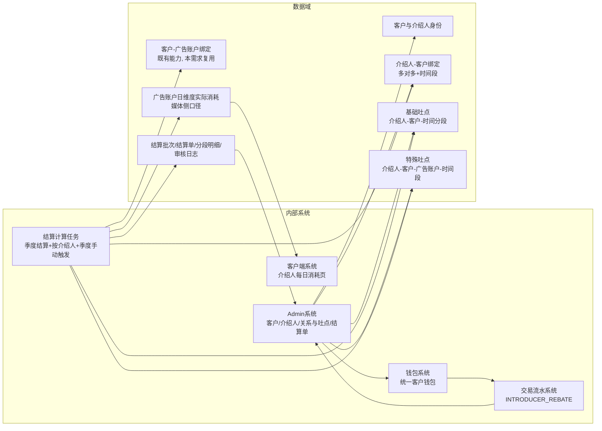

## 全局流程图
### 4.1 业务流程图

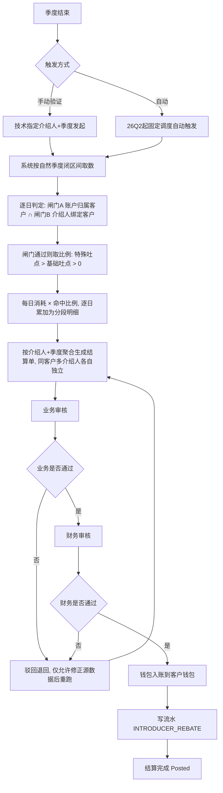

### 4.2 业务实体关系

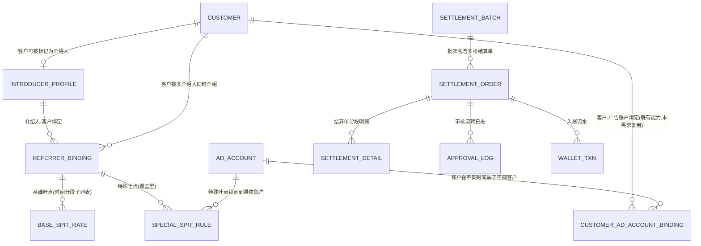

> 说明: BASE_SPIT_RATE (介绍人-客户级基础吐点, 时间分段) 与 SPECIAL_SPIT_RULE (介绍人-客户-广告账户级特殊吐点, 覆盖型) 均挂在 REFERRER_BINDING 之下, 在 Admin 的同一个模块"介绍人关系与吐点"内维护; CUSTOMER_AD_ACCOUNT_BINDING 引用既有能力, 不新建; SETTLEMENT_DETAIL 含"比例来源"字段标识基础/特殊.
### 4.3 系统流程图

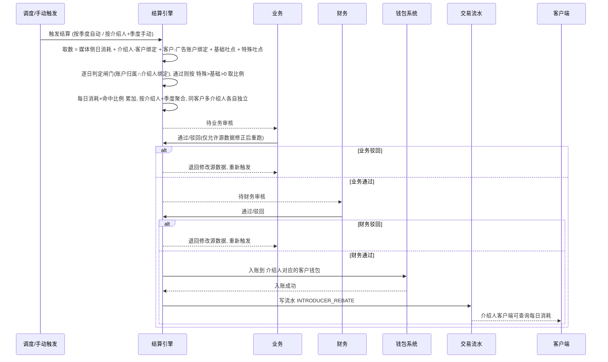

## 功能清单&版本规划

| 系统 | 模块 | 页面 | 功能点 | 优先级 | 版本号 |
| --- | --- | --- | --- | --- | --- |
| 运营系统 | 主要功能-介绍人和吐点 | 介绍人列表 | 从客户中标记/取消介绍人身份, 配置该介绍人的客户端可见性开关, 展示关联客户数与成为时间 | P0 | V1.0 |
| 运营系统 | 主要功能-介绍人和吐点 | 介绍人关系与吐点 | 介绍人-客户绑定关系管理 (多对多+时间段); 吐点规则子页维护基础/特殊吐点(弹窗); 生效预览按季度时间轴按段展示(含无规则空档) | P0 | V1.0 |
| 运营系统 | 主要功能-介绍人和吐点 | 吐点结算 | Admin 手动发起结算(介绍人多选+系统批次枚举); 自动季度发起; 闸门+优先级逐日取值; 业务/财务审核弹窗; 详情弹窗与 CSV | P0 | V1.0 |
| 运营系统 | 客户流水 | 交易明细 | 新增交易类型 INTRODUCER_REBATE, 可筛选可追溯到结算单 | P0 | V1.0 |
| 客户端 | 每日消耗查看 | 介绍人每日消耗页 | 由运营后台介绍人级开关控制可见性, 支持查看被介绍客户每日广告消耗, 严禁展示吐点与收益 | P0 | V1.0 |

---

## 运营系统
- 在「主要功能」中增加「介绍人和吐点」页面
- 「介绍人和吐点」页面由「介绍人列表」、「介绍人关系与吐点」、「吐点结算」这3个Tab组成。
### 6.1 介绍人列表
#### 6.1.1 名词解释

| 名词 | 定义 | 举例/说明 |
| --- | --- | --- |
| 介绍人 | 在客户体系中已存在并被运营标记为介绍人身份的客户 | 客户 C001 被设置为介绍人 |
| 介绍人创建 | 从现有客户中选择并启用介绍人身份, 不创建新用户 | 客户 C001 → 介绍人 C001 |
| 介绍人停用 | 仅停用身份标记, 已存在的关系/基础吐点/特殊吐点全部保留, 仍会参与季度结算 | 停用后系统不允许新建该介绍人的关系/吐点; 已有配置仍生效 |
| 关联客户数 | 当前介绍人名下处于有效绑定期 (今日落在绑定时间段内) 的被介绍客户数量 | 12 个 |
| 客户端可见性开关 | 控制该介绍人在客户端是否能看到自己被介绍客户的每日消耗 | 默认关闭, 由运营单独开启 |

#### 6.1.2 流程图

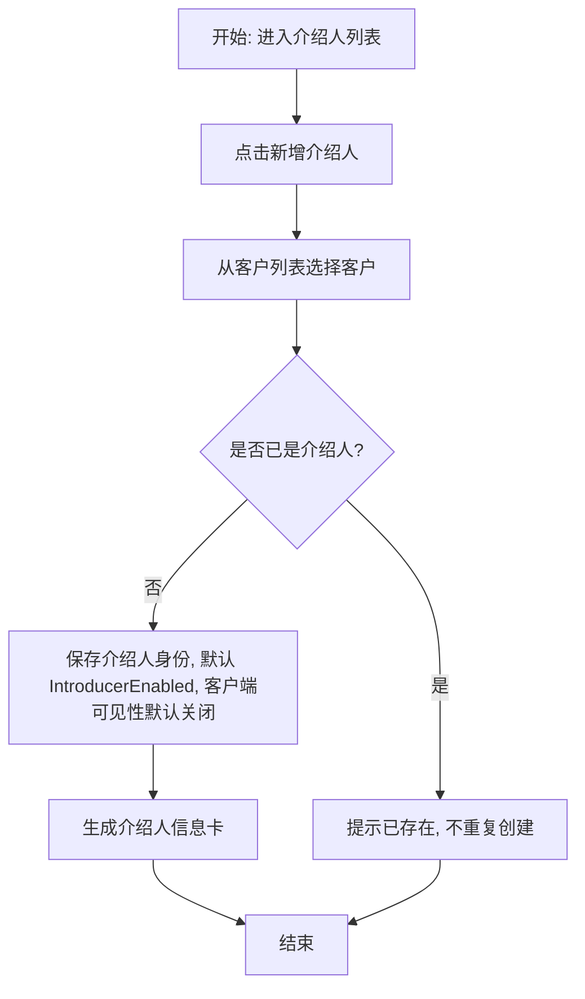

#### 6.1.3 状态机
##### 6.1.3.1 状态流转图

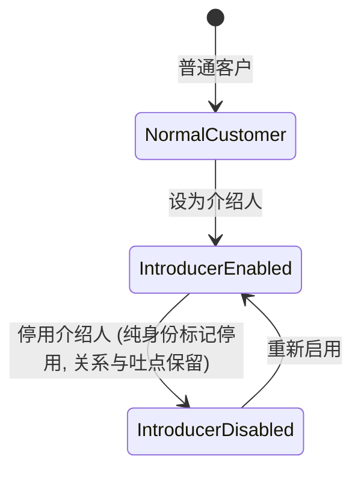

##### 6.1.3.2 状态——可执行的操作

| 状态 | 角色 | 可执行操作 | 前置/约束条件 | 执行结果(后置状态) | 批量操作 |
| --- | --- | --- | --- | --- | --- |
| NormalCustomer | 运营 | 设为介绍人 | 客户存在且未删除 | IntroducerEnabled | 否 |
| IntroducerEnabled | 运营 | 停用介绍人 | 二次确认; 提示关系与吐点保留, 仍参与结算 | IntroducerDisabled | 否 |
| IntroducerEnabled | 运营 | 切换客户端可见性 | 无 | IntroducerEnabled | 否 |
| IntroducerDisabled | 运营 | 启用介绍人 | 客户状态正常 | IntroducerEnabled | 否 |

#### 6.1.4 原型
- 页面为介绍人列表页.
- 空态: 暂无介绍人.
- 列表展示介绍人核心信息: 客户端可见性开关, 关联客户数, 成为介绍人时间, 介绍人状态.
- "客户端可见性"开关与 7.1 客户端介绍人每日消耗页是同一逻辑开关, 6.1 是控制点, 7.1 是表现点.
#### 6.1.5 功能说明
##### 6.1.5.1 筛选项

| 字段名 | 类型 | 默认值 | 说明 |
| --- | --- | --- | --- |
| 介绍人商户ID | 文本 | 空 |  |
| 介绍人客户名称 | 文本 | 空 |  |
| 状态 | 枚举单选 | 空 |  |
| 客户端可见性 | 枚举单选 | 空 | 是否可以在客户端展示下级客户的消耗 |
| 成为介绍人时间 | 日期+时间 | 空 | 客户成为介绍人的时间。如：2026-5-14 23:59:59 |
| 操作人 | 枚举多选 | 空 | 添加介绍人的操作人员。如：欧伟权(ouweiquan@bestfulfill.com) |

##### 6.1.5.2 列表字段说明

| 字段名 | 类型 | 说明 |
| --- | --- | --- |
| 介绍人商户ID | 文本 |  |
| 介绍人客户名称 | 文本 |  |
| 客户端可见性 | 布尔 | 支持切换可见/不可见 |
| 状态 | 布尔 | 支持切换启动/禁用 |
| 关联客户数 | 数值 |  |
| 成为介绍人时间 | 日期+时间 |  |
| 操作人 | 文本 |  |

##### 6.1.5.3 排序规则
- 支持按成为介绍人时间, 关联客户数排序.
##### 6.1.5.4 交互说明
- 点击新增打开选择客户弹窗, 已是介绍人的客户不可重复添加.
- 切换"客户端可见性"开关后立即生效, 不需二次确认.
- "停用介绍人"在二次确认弹窗中明确提示: 现有关系/基础吐点/特殊吐点仍然保留并参与结算, 仅是身份标记停用.
##### 6.1.5.5 操作
- 单条: 设为介绍人, 启用/停用介绍人, 切换客户端可见性.
- 高风险操作 (停用) 需二次确认.
- 不支持批量操作.

---

### 6.2 介绍人关系与吐点
> 本模块由 v0.3 的"介绍人关系与基础吐点"与"特殊吐点规则"合并而来. 一个介绍人-客户关系下的关系信息、基础吐点、特殊吐点在同一页面维护, 并通过"生效预览"时间轴统一查看.
#### 6.2.1 名词解释

| 名词 | 定义 | 举例/说明 |
| --- | --- | --- |
| 介绍人-客户绑定 | 介绍人与被介绍客户之间的绑定关系, 记录生效时间段; 同一客户可同时被多个介绍人绑定 | 介绍人A在 2026-01-01~ 介绍客户C, 同时介绍人B在 2026-04-01~ 也介绍客户C |
| 生效时间段 | 用于分段计算消耗归属的起止时间, 按"自然日"为最小切分单位 | 2026-02-03 ~ 2026-04-30, 时间字段实际只取日期部分 |
| 同日切换归属 | 当某天既是旧关系结束日又是新关系开始日时, 该天消耗归切换后的介绍人 | 介绍人A截止 2026-02-02, 介绍人B起于 2026-02-03, 2 月 3 日全天归 B |
| 多介绍人独立结算 | 同一客户被多个介绍人同时介绍时, 各自按自己的吐点配置独立结算, 互不分润 | 介绍人A拿账户C 1%, 介绍人B拿账户C 0.5%, 平台总出资 1.5% |
| 基础吐点 | 介绍人-客户关系下的默认吐点比例, 作用于该客户名下全部广告账户; 是时间分段子列表, 每段有独立比例与起止时间 | 介绍人A对客户C: 2026-01-01~2026-06-30 为 1%, 2026-07-01~ 为 1.5% |
| 基础吐点必填 | 建立介绍人-客户关系时必须至少配置一段基础吐点, 比例允许填 0 (即显式声明默认不吐) | 谈价未定时可先填 0%, 后续再调 |
| 特殊吐点 | 介绍人-客户-广告账户-比例-时间段 配置, 是对基础吐点的"整段覆盖", 不与基础吐点叠加 | 介绍人A对客户C名下账户AD123, 2026Q1 用 3% (覆盖基础的 1%) |
| 继承基础吐点 | 广告账户未配置特殊吐点时的默认状态, 该账户消耗按基础吐点计算 | AD-1001 未配特殊吐点, 显示"继承基础吐点" |
| 覆盖语义 | 特殊吐点生效期内, 该账户当天直接用特殊比例, 完全替换基础吐点; 特殊吐点不生效的日子回落到基础吐点 | 特殊吐点只覆盖 1-3 月, 则 4 月该账户回落基础吐点 |
| 同维度唯一性 | 同一介绍人对同一广告账户在同一时间点只能有一条特殊吐点 | 不允许重叠 |
| 跨介绍人独立 | 不同介绍人对同一广告账户的特殊吐点可以重叠并各自独立结算 | 介绍人A 3% + 介绍人B 0.5% 同期共存 |
| 休眠状态 | 计算出来的展示状态: 当广告账户已与客户解绑、或介绍人-客户关系已解除时, 对应特殊吐点显示"休眠中"; 配置数据不变, 依赖恢复后自动恢复生效 | 账户从客户C解绑后, 该特殊吐点列表显示"休眠中-账户已解绑" |
| 生效预览 | 把基础吐点与特殊吐点合并后, 逐月展示每个广告账户实际命中比例的时间轴视图 | 见 6.2.4 原型与 6.2.5.5 |

#### 6.2.2 流程图
##### 6.2.2.1 关系与基础吐点维护流程

```mermaid
flowchart TD
  A[开始: 打开介绍人关系与吐点页] --> B[在关系列表选择介绍人/筛选]
  B --> C[新增被介绍客户关系]
  C --> D[填写客户与关系生效时间段]
  D --> E[配置至少一段基础吐点(比例可填0)]
  E --> F{校验关系与基础吐点}
  F -- 不合法 --> G[阻止保存并展示错误原因]
  F -- 合法 --> H[保存关系 + 基础吐点子列表]
  H --> I[关系出现在列表, 可进入详情维护特殊吐点]
  G --> D
```

##### 6.2.2.2 特殊吐点维护流程

```mermaid
flowchart TD
  A[在关系列表选中一条关系, 打开详情区] --> B[特殊吐点子区列出该客户名下广告账户]
  B --> C{账户当前是否已配特殊吐点}
  C -- 否, 继承基础吐点 --> D[点击"设为特殊吐点"]
  C -- 是 --> E[在账户下新增/编辑特殊吐点分段]
  D --> E
  E --> F[输入比例 0-100% 与时间段]
  F --> G{校验通过?}
  G -- 否 --> H[提示错误并阻止保存]
  G -- 是 --> I[保存特殊吐点]
  I --> J[生效预览时间轴同步刷新]
  H --> E
```

校验规则:
- 介绍人和客户都必须存在且未删除.
- 同一介绍人对同一客户的两个绑定时间段不允许重叠 (不允许新关系紧接前一关系的结束日开始。即不能同日切换).
- 不校验同一客户的多个不同介绍人之间是否重叠 (允许多人同时介绍)。即介绍人A下有客户B，介绍人C下也可以有客户B。
- 关系结束时间允许为空表示长期有效。即关系开始时间为2026年1月1日~空，这是允许的，表示关系从26年1月1日开始，至今有效。
- 建立关系时必须至少有一段基础吐点, 第一段开始时间默认对齐关系开始时间, 比例范围 0-100% (允许 0)。
- 基础吐点子列表内各段时间不允许重叠; 允许存在时间空档, 空档期视为无基础吐点 (结算时落到优先级 3)。即介绍人A下的客户B，26年1月~3月吐点2%，4月~6月吐点1%，这个是允许的。但是不允许1~4月2%并且4~6月1%。
- 特殊吐点比例范围 0-100%, 时间段必填, 结束时间允许为空表示长期生效.
- 同一介绍人对同一广告账户的特殊吐点时间段不允许重叠.
- 特殊吐点的广告账户选择受所选客户控制, 仅可选该客户当前或历史绑定过的广告账户。（绑定过的广告账户是因为存在要补充数据的场景。）
- 不校验"广告账户当前是否绑在该客户名下"、"介绍人和客户是否存在绑定关系" 这些由结算引擎按闸门自动取交集;
- 失去依赖的特殊吐点在列表与生效预览中显示"休眠中"。（客户解绑广告账户，但是看复杂程度，这个不是特重要）
#### 6.2.3 状态机
##### 6.2.3.1 关系状态流转图

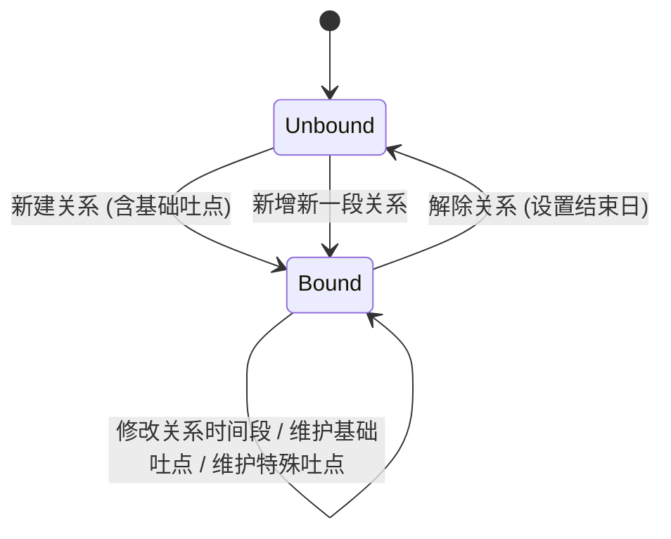

> 关系的"解除"实际是把当前生效段的结束时间设为今日, 历史关系、历史基础吐点段、历史特殊吐点永久保留供结算回溯. 基础吐点作为关系下的子列表记录, 通过增删改时间分段管理, 不单独设状态机.
##### 6.2.3.2 特殊吐点状态流转图

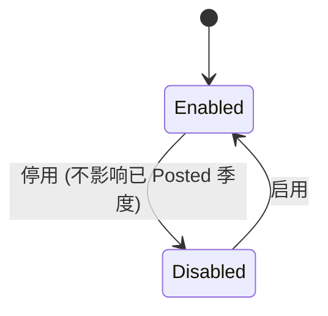

> Enabled/Disabled 是运营手动控制的配置状态. "休眠中"是结算视角的计算状态, 与配置状态正交: 一条 Enabled 的特殊吐点, 若其账户当前已与客户解绑或关系已解除, 列表与生效预览展示为"Enabled · 休眠中". Disabled 的特殊吐点在结算引擎中视同不存在, 不做物理删除以保证审计可追溯.
##### 6.2.3.3 状态——可执行的操作

| 对象 | 状态 | 角色 | 可执行操作 | 前置/约束条件 | 执行结果(后置状态) | 批量操作 |
| --- | --- | --- | --- | --- | --- | --- |
| 关系 | Unbound | 运营 | 新建关系 | 介绍人/客户存在; 必须同时配置基础吐点 | Bound | 否 |
| 关系 | Bound | 运营 | 修改关系时间段 | 不能与该 介绍人-客户对的其他段重叠 | Bound | 否 |
| 关系 | Bound | 运营 | 解除关系 | 二次确认; 历史段保留 | Unbound | 否 |
| 基础吐点 | - | 运营 | 新增/编辑/删除分段 | 段内时间不重叠; 至少保留一段 | - | 否 |
| 特殊吐点 | Enabled | 运营 | 编辑, 停用 | 配置存在; 编辑保存时复跑校验 | Enabled/Disabled | 否 |
| 特殊吐点 | Disabled | 运营 | 启用 | 时间段有效且不与同维度其他启用项重叠 | Enabled | 否 |

#### 6.2.4 原型
页面: 介绍人关系与吐点 Tab, 分 **关系列表视图** 与 **吐点规则子页** 两级:
- **关系列表视图**
  - 顶部筛选区: 介绍人、客户等, 见 6.2.5.1.
  - 列表每行为一条 介绍人-客户关系, 字段见 6.2.5.2; 同一客户被多个介绍人介绍时呈现为多行.
  - 操作列提供 **「吐点规则」**; 点击后进入子页, 列表行可高亮标识当前关系.
- **吐点规则子页** (由关系列表进入, 提供 **「返回关系列表」**)
  - 关系信息头: 介绍人 → 客户、关系状态徽标、关系生效期、该客户同期其他介绍人提示 (若有).
  - **基础吐点子区**: 分段子列表 + **「新增分段」**; 通过 **弹窗** 新增/编辑 (比例、生效开始、生效结束/长期); 支持删除分段, 但至少保留一段 (仅剩一段时不可删).
  - **特殊吐点子区**: 顶部 **「新增账户特殊吐点」**; 账户来自该客户 **当前绑定与历史绑定** 的广告账户列表; 按账户分组展示分段; 未配置账户可 **「设为特殊吐点」**; 已配置账户可 **「新增分段」** / **「编辑分段」** (弹窗维护比例、时间段、启用/停用); 账户已解绑等场景在分组上展示 **「休眠中 + 原因」** 徽标 (仅配置区, 与生效预览「无规则」区分).
  - **生效预览**: 可选 **预览年 + 季度**; 顶部展示该季度自然日区间; **无固定月/日表头**; 每个广告账户一行 **时间轨道**, 按 **连续相同生效结果** 合并为色块, 块宽与区间天数成正比; 块内标注 **日期区间 (如 MM.DD~MM.DD) + 比例 + 类型**; 图例: **特殊吐点 / 基础吐点 / 无规则** (空档).
- 空态: 关系列表「暂无关联客户」; 子页基础吐点无分段时引导新增.
- 异常态: 分段时间重叠、仅剩一段不可删、介绍人/客户不存在、特殊吐点休眠提示.
#### 6.2.5 功能说明
##### 6.2.5.1 筛选项 (关系列表)

| 字段名 | 类型 | 默认值 | 说明 |
| --- | --- | --- | --- |
| 介绍人商户ID | 文本 | 空 | 支持多选 |
| 介绍人客户名称 | 文本 | 空 | 模糊搜索 |
| 下级商户ID | 文本 | 空 | 支持多选 |
| 下级客户名称 | 文本 | 空 | 模糊搜索 |

##### 6.2.5.2 关系列表字段说明

| 字段名 | 类型 | 说明 |
| --- | --- | --- |
| 介绍人商户ID | 文本 |  |
| 介绍人客户名称 | 文本 |  |
| 下级商户ID | 文本 |  |
| 下级客户名称 | 文本 |  |
| 关系生效期 | 文本 | 生效开始 ~ 生效结束, 空结束显示"长期" |
| 当前基础吐点 | 数值 | 今日命中的基础吐点比例; 无命中段显示 0 或"-" |
| 特殊吐点数 | 数值 | 该关系下处于 Enabled 的特殊吐点条数 |
| 当前状态 |  |  |
| 操作 |  | 吐点规则 |

##### 6.2.5.3 吐点规则——基础吐点子区
- 字段: 基础吐点比例 (百分比, 2 位小数, 允许 0)、生效开始日期、生效结束日期 (空表示长期)、更新人/更新时间.
- 交互: **新增分段 / 编辑分段** 均通过 **弹窗** 维护; 支持勾选「长期有效」时禁用结束日.
- 排序: 按生效开始日期升序.
- 操作: 新增分段、编辑分段、删除分段; **至少保留一段** — 当前仅一段时 **禁止删除** 该段; 列表清空或全删时 **阻止保存**.
- 校验: 各分段时间段 **不可重叠** (含边界日); 允许时间空档, 空档期在结算与预览中视为 **无规则**.
##### 6.2.5.4 吐点规则——特殊吐点子区
- 按该客户 **当前与历史绑定** 的广告账户分组展示, 每个账户一个分组块.
- 账户分组块字段: 广告账户ID/名称、绑定来源 (当前绑定 / 历史绑定)、配置状态 (继承基础吐点 / 已配特殊吐点)、计算状态 (生效中 / 休眠中 + 原因).
- **新增账户特殊吐点**: 弹窗内从上述账户列表 **多选尚未配置特殊吐点的账户** (已配置账户不可重复新增, 须用「新增分段」).
- 已配置账户下的特殊吐点分段字段: 特殊吐点比例 (百分比, 2 位小数)、生效开始日期、生效结束日期 (空表示长期)、配置状态 (启用/停用)、更新人/更新时间.
- 交互: **设为特殊吐点 / 新增分段 / 编辑分段** 均通过 **弹窗** 维护比例、时间段与配置状态.
- 校验: 同一介绍人对同一广告账户的特殊吐点时间段不重叠; 重叠时阻止保存并提示冲突项.
- 休眠提示: 账户已与客户解绑或关系已解除时, 该账户分组显示「休眠中」徽标, 不阻止编辑, 但提示当前不参与结算.
##### 6.2.5.5 吐点规则——生效预览
- 视图形态: **季度时间轴** (Gantt 风格). 运营选择 **预览年 + 季度**; 页面展示该季度自然日闭区间 (如 2026-01-01 ~ 2026-03-31); **不设固定月表头或日刻度表头**.
- 每个广告账户占一行; 行内为一条与季度等宽的时间轨道.
- 预览按 **自然日** 与结算引擎同口径逐日取值, 将 **连续相同结果** 的日期合并为一段, 在轨道上绘制色块; 色块 **宽度与该段天数占季度总天数比例成正比**; 色块内文案含 **起止日期 + 命中比例 + 类型**.
- 色块类型与图例 (固定展示):
  - **特殊吐点**: 当天命中已启用的特殊吐点分段.
  - **基础吐点**: 未命中特殊但命中基础吐点分段.
  - **无规则**: 闸门未通过、无命中分段或命中比例为 0 的空档 (灰色), **不单独展示「休眠」色块**.
- 取值优先级与 6.3.2 一致: 特殊吐点 (Enabled) > 基础吐点 > 无规则 (等价结算优先级 3).
- 仅展示, 不可在预览上直接编辑; 修改基础吐点或特殊吐点保存后 **即时重算刷新**.
##### 6.2.5.6 排序规则
- 关系列表默认按生效开始日期降序, 支持按生效状态、更新时间排序.
- 基础吐点分段按生效开始日期升序; 特殊吐点账户分组按账户ID升序, 组内分段按生效开始日期升序.
##### 6.2.5.7 交互说明
- 关系列表点击 **「吐点规则」** 进入子页; 子页 **「返回关系列表」** 回到列表, 保留筛选条件.
- 新建关系弹窗内「基础吐点」为必填区, 至少一段, 不填则阻止保存.
- 编辑关系/基础吐点/特殊吐点时, 如改动会影响已 Posted 季度的应得金额, 强提示「修改不会回算已 Posted 季度」.
- 同一客户同期已存在其他介绍人时, 吐点规则子页头部展示信息条, 列出该客户当前其他介绍人.
- 基础吐点、特殊吐点保存成功后, 生效预览 **即时重算刷新**.
- 切换预览年/季度时, 仅重绘生效预览区, 不改动配置数据.
- 对「休眠中」的特殊吐点配置不阻止编辑, 保存时再次提示其当前因依赖缺失不参与结算.
##### 6.2.5.8 操作
- 关系列表: 新增关系、修改关系、解除关系; 进入吐点规则子页.
- 吐点规则子页: 返回关系列表; 基础吐点新增/编辑/删除分段 (至少保留一段); 特殊吐点新增账户、设为特殊吐点、新增/编辑分段.
- 不支持批量操作.

---

### 6.3 吐点结算
#### 6.3.1 名词解释

| 名词 | 定义 | 举例/说明 |
| --- | --- | --- |
| 结算批次 | 一次发起结算所产生的全部结算单的逻辑包 | 2026Q2 自动结算批次 |
| 结算单 | 一个介绍人在某一季度的结算主体 | 介绍人A的 2026Q2 结算单 |
| 分段明细 | 结算单下按 季度+介绍人+客户+广告账户+命中比例+比例来源 拆分的最细行 | 每行对应一段连续同比例的 segment_consume × rate |
| 比例来源 | 标识该明细行命中的比例来自基础吐点还是特殊吐点 | 基础 / 特殊 |
| 实际消耗 | 媒体侧回传的广告账户日维度实际消耗 | 媒体侧口径, 不含平台加价/服务费 |
| 业务审核 | 业务角色对草案核对确认 | 通过/驳回 |
| 财务审核 | 财务角色对草案复核确认 | 通过/驳回 |
| 同人多角色 | 业务和财务角色不强制互斥, 同一账号可拥有两个角色, 走两道关卡 | 由权限模块控制 |

#### 6.3.2 计算逻辑
##### 6.3.2.1 取数源
- 媒体侧广告账户日维度实际消耗.
- 介绍人-客户绑定时间段 (6.2, 多介绍人允许同期共存).
- 客户-广告账户绑定时间段 (既有能力, 本需求复用).
- 基础吐点时间分段 (6.2).
- 特殊吐点 (6.2, 仅配置状态 Enabled 的参与计算).
##### 6.3.2.2 逐日取值算法
对每个 (介绍人 I, 客户 C, 广告账户 A, 自然日 D), D 落在结算季度 [q_start, q_end] 内:
第一步 前置闸门 (两个都成立, 这天才计入; 任一不成立则当天跳过):
- 闸门 A: 当天广告账户 A 归属于客户 C (命中 CUSTOMER_AD_ACCOUNT_BINDING 中 C-A 的某个生效段).
- 闸门 B: 当天介绍人 I 与客户 C 存在有效绑定 (命中 REFERRER_BINDING 中 I-C 的某个生效段).
第二步 比例取值 (闸门通过后, 按优先级取第一个命中的):
- 优先级 1: 存在 (I, C, A) 的特殊吐点在当天生效 (Enabled 且 D 落在其时间段) → 命中比例 = 特殊比例, 比例来源 = 特殊.
- 优先级 2: 否则存在 (I, C) 的基础吐点段在当天生效 (D 落在某段时间内) → 命中比例 = 基础比例, 比例来源 = 基础.
- 优先级 3: 否则 → 命中比例 = 0, 当天不产生吐点.
第三步 金额:
- 当天该 (I, C, A) 的吐点 = round(当天媒体侧实际消耗 × 命中比例, 2 位小数, 四舍五入).
- 货币统一 USD, 不做币种转换.
##### 6.3.2.3 多介绍人独立
- 同一客户被多介绍人介绍时, 不做任何分润折算, 每个介绍人按上述算法独立取值与累加, 平台总出资可能 > 该账户消耗 × 100%, 由业务侧自行控制.
- 同一介绍人对同一账户同时段特殊吐点唯一、基础吐点段不重叠 (见 6.2 校验), 因此不会出现同人重复计算同一笔消耗的情况.
##### 6.3.2.4 结算单聚合规则
- 一张结算单 = 一个介绍人 × 一个季度.
- 结算单金额 = 该介绍人下所有 (客户, 广告账户, 日) 取值结果之和.
- 结算单下挂分段明细, 明细按 季度 + 介绍人 + 客户 + 广告账户 + 命中比例 + 比例来源 聚合, 连续同比例的天数合并为一行并展示该行的起止日期、消耗小计、返还小计.
##### 6.3.2.5 0 元处理
- 如果某介绍人在某季度按上述算法的合计金额为 0 (闸门全不通过 / 命中比例恒为 0 / 账户无消耗), 不生成结算单, 不进入审核队列.
##### 6.3.2.6 触发方式
- **Admin 手动发起 (验证及运营补发)**:
  - 入口: 吐点结算页 **「手动发起结算」** 按钮, 打开弹窗.
  - 字段: **介绍人商户ID (多选)**、**结算批次 (下拉单选)**.
  - 结算批次选项由 **接口下发系统已有批次枚举**, 前端不得自由输入; 无可用批次时展示空态并禁止提交.
  - 发起规则: 对每个选中的介绍人商户ID, 在所选结算批次下, 若已存在状态为 **待业务 / 待财务 / 已完结** 的结算单, 则该组合 **不可再次发起**; 状态为 **已作废** 的可重新发起; **已完结** 不可再发起.
  - 提交成功后按「介绍人 × 批次」生成草案 (具体是否合并为一张结算单由后端批次模型决定, 列表按结算单展示).
- **26Q1 验证**: 除上述 Admin 手动发起外, 仍保留技术侧按 介绍人 + 季度 的接口/脚本能力, 用于批量验收.
- **26Q2 起 (正式阶段)**: 由调度模块在自然季度结束后第 45 自然日触发全量结算. 调度模块的具体实现 (容错/重跑/告警) 由调度模块独立维护, 不在本 PRD 范围.
- 入账接口的可靠性 (失败重试/补偿) 由钱包系统现有方案保障, 不在本 PRD 范围.
#### 6.3.3 流程图

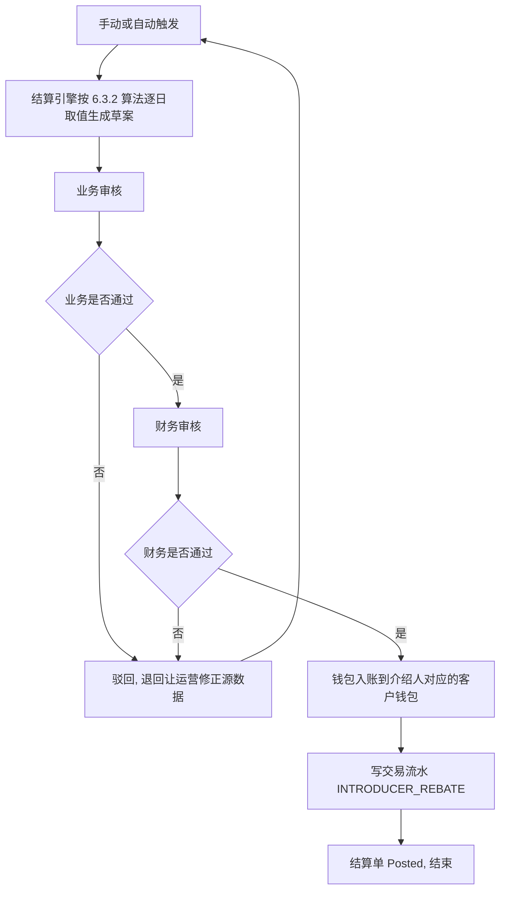

#### 6.3.4 状态机
##### 6.3.4.1 状态流转图

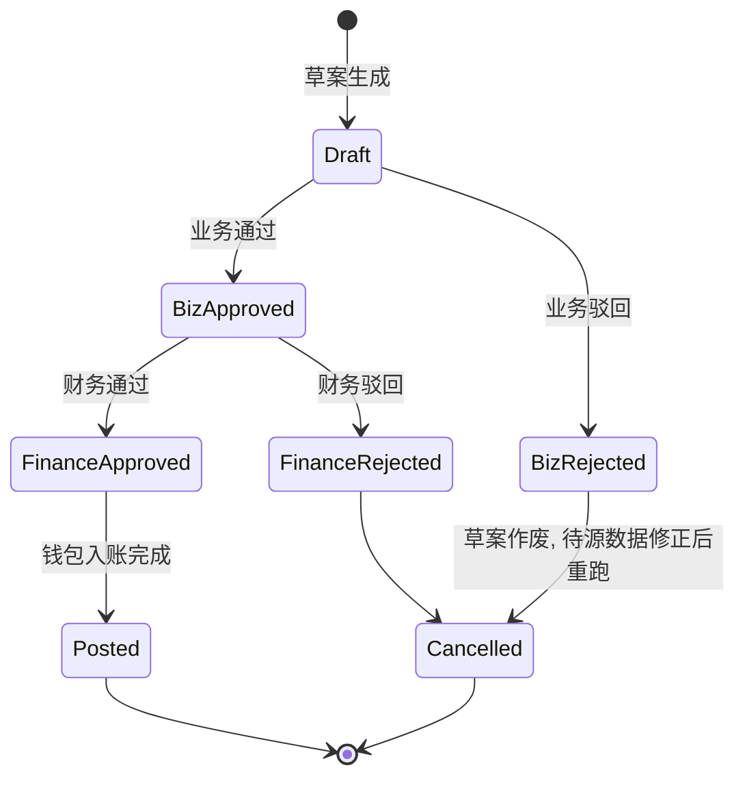

> 不存在"驳回 → 改金额 → 重新提交"的路径; 驳回后草案作废, 必须由运营修正源数据 (关系/基础吐点/特殊吐点/账户绑定) 后重新触发结算. Posted 状态为终态, 不可再变更.
##### 6.3.4.2 状态——可执行的操作

| 状态 | 角色 | 可执行操作 | 前置/约束条件 | 执行结果(后置状态) | 批量操作 |
| --- | --- | --- | --- | --- | --- |
| Draft | 业务 | 通过, 驳回(必须填备注) | 草案已生成 | BizApproved/BizRejected | 是 (按当前筛选范围全选) |
| BizApproved | 财务 | 通过, 驳回(必须填备注) | 业务已通过 | FinanceApproved/FinanceRejected | 是 |
| BizRejected / FinanceRejected | 系统 | 自动作废 | - | Cancelled | - |
| FinanceApproved | 系统 | 自动入账 | 钱包系统可用 | Posted | - |
| Posted | - | 不可再变更 | - | - | - |

#### 6.3.5 原型
- 页面: 吐点结算 Tab.
- 页头: 标题区右侧 **「手动发起结算」** 按钮 (非页内长表单).
- 分区: 筛选区、结算单列表 (表头不换行, 列过多时 **横向滚动**)、**手动发起弹窗**、**审核弹窗**、**详情弹窗**.
- **手动发起弹窗**: 介绍人商户ID **复选框多选**; 结算批次 **下拉单选** (选项来自接口).
- **审核弹窗**: 单条「业务审核」或「财务审核」打开; 选择 **通过 / 驳回**; 驳回时 **备注必填**.
- **详情弹窗**: 按客户分组展示分段明细 (账户、命中比例、比例来源、时间段、消耗、返还); 提供 **下载明细 CSV**; 关闭按钮.
- 异常态: 入账失败由钱包系统侧通知, 本页只展示状态; 手动发起冲突时 Toast/文案提示不可发起的介绍人+批次组合.
#### 6.3.6 功能说明
##### 6.3.6.0 手动发起结算

| 字段名 | 类型 | 默认值 | 说明 |
| --- | --- | --- | --- |
| 介绍人商户ID | 枚举多选 | 空 | 从系统可选介绍人列表勾选, 至少选 1 个 |
| 结算批次 | 枚举单选 | 空 | 选项由 **接口下发** 的系统已有结算批次列表, 不可手输 |

- 入口: 页头 **「手动发起结算」** → 弹窗 → **「发起结算」**.
- 校验: 未选介绍人或未选批次时阻止提交; 按 6.3.2.6 规则校验每个 (介绍人商户ID, 结算批次) 组合是否可发起; 部分不可发起时提示具体介绍人商户ID列表.
- 成功: 关闭弹窗并提示已提交; 新草案出现在下方列表 (异步生成时展示加载/刷新提示).

##### 6.3.6.1 筛选项

| 字段名 | 类型 | 默认值 | 说明 |
| --- | --- | --- | --- |
| 结算批次 | 文本 | 空 |  |
| 介绍人商户ID | 文本 | 空 |  |
| 介绍人客户名称 | 文本 | 空 |  |
| 状态 | 枚举 | 空 | 待业务/待财务/已完结/已作废 |

##### 6.3.6.2 列表字段说明

| 字段名 | 类型 | 说明 |
| --- | --- | --- |
| 结算单ID |  | 可以用结算批次+介绍人商户ID+序号来生成，如：2026Q112345001 |
| 介绍人商户ID |  |  |
| 介绍人客户名称 |  |  |
| 结算批次 |  |  |
| 涉及客户数 |  |  |
| 涉及账户数 |  |  |
| 实际消耗总额 |  |  |
| 佣金 |  |  |
| 状态 |  | 待业务/待财务/已完结/已作废 |
| 触发方式 |  |  |
| 备注 |  |  |
| 操作 |  | 见 6.3.6.5; 按状态展示详情、业务审核或财务审核 |

> "吐点比例"不作为列表字段, 因为同一介绍人对不同账户、不同时间段可能命中不同比例; 只在 **详情弹窗** 内按行展示命中比例与比例来源.
> 列表 **表头不换行**; 字段较多时容器 **横向滚动** 查看.
##### 6.3.6.3 排序规则
- 默认按结算单更新时间降序.
- 支持按实际消耗, 佣金排序.
##### 6.3.6.4 交互说明
- **手动发起结算**: 见 6.3.6.0; 弹窗内介绍人商户ID **至少选 1 个**; 结算批次 **必选** 且仅能从接口下发的枚举中选择.
- **列表**: 表头文案不换行; 内容过宽时 **左右滑动** 查看全部列.
- **详情**: 点击操作列 **「详情」** 打开 **详情弹窗** (非抽屉); 支持 **下载分段明细 CSV**; 关闭后回到列表.
- **审核**: 状态为 **待业务** 时展示 **「业务审核」**; 状态为 **待财务** 时展示 **「财务审核」**; 点击打开 **统一审核弹窗**, 选择 **通过** 或 **驳回**; **驳回时备注必填**; 通过后更新状态与备注列 (原型); 已完结/已作废仅保留详情.
- **批量业务通过**: 仅对当前筛选下已勾选且处于待业务的行生效; 操作前二次确认并展示条数.
- 业务/财务角色不互斥, 但同一结算单不允许 **自审自批** — 若当前账号已在业务审节点完成通过/驳回, 同一账号在财务审节点禁用该单操作 (兜底审计).
- 入账由系统在 FinanceApproved 后自动触发; 入账失败由钱包侧通知, 本页仅展示状态.
##### 6.3.6.5 操作
- **手动发起结算** (页头按钮 → 弹窗, 见 6.3.6.0).
- **详情** (单条, 详情弹窗 + CSV 下载).
- **业务审核** (单条, 待业务; 审核弹窗通过/驳回).
- **财务审核** (单条, 待财务; 审核弹窗通过/驳回).
- **批量业务通过** (待业务多选).
- 不支持在列表直接修改金额; 驳回后须修正源数据并重新发起结算.

---

### 6.4 模块a(交易明细)
#### 6.4.1 名词解释

| 名词 | 定义 | 举例/说明 |
| --- | --- | --- |
| 介绍人吐点结算交易 | 由季度结算入账产生的专有流水 | 类型 INTRODUCER_REBATE |

#### 6.4.2 流程图

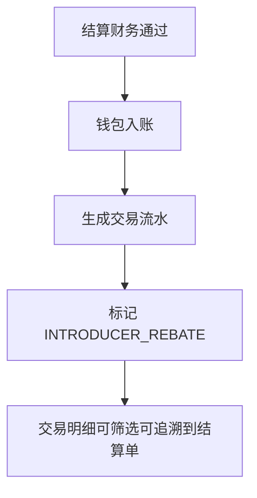

---

## 客户端
### 7.1 My client's daily ad spend
#### 7.1.1 名词解释

> [飞书嵌入电子表格] `sheet-id=goSsBO` `token=JfousXkp0ha39utkFVjc66XHnBg`

#### 7.1.2 流程图

```mermaid
flowchart TD
  A[用户登录客户端] --> B{是介绍人角色?}
  B -- 否 --> C[隐藏菜单与页面入口]
  B -- 是 --> D{该介绍人客户端可见性开关 = 开?}
  D -- 否 --> C
  D -- 是 --> E[展示介绍人每日消耗菜单]
  E --> F[进入每日消耗页面]
  F --> G[选择日期范围 + 客户/账户筛选]
  G --> H[查询每日实际消耗 (媒体侧口径)]
  H --> I{查询成功?}
  I -- 否 --> J[展示错误提示并允许重试]
  I -- 是 --> K[展示列表 + 趋势图]
  K --> L[结束]
  C --> L
  J --> G
```

#### 7.1.3 状态机
##### 7.1.3.1 状态流转图

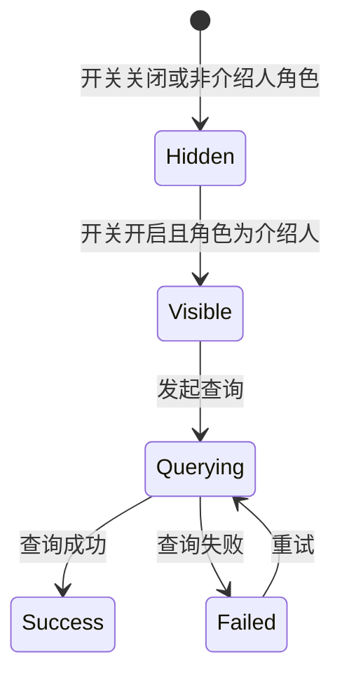

##### 7.1.3.2 状态——可执行的操作

> [飞书嵌入电子表格] `sheet-id=Qy3mov` `token=JfousXkp0ha39utkFVjc66XHnBg`

#### 7.1.4 原型
- 页面: `bestads-client-styled/introducer-daily-consume.html`
- 内容: 查询区, 指标卡 (总消耗/客户数/账户数), 每日消耗列表, 趋势图.
- 严禁字段: 吐点比例, 吐点金额, 预计返还金额, 已结算金额, 钱包余额中吐点部分等任何与收益相关的字段.
- 数据范围: 仅当前介绍人当前生效与历史绑定过的被介绍客户的广告账户日维度消耗. 不展示该客户其他介绍人的存在与否.
#### 7.1.5 功能说明
##### 7.1.5.1 筛选项

> [飞书嵌入电子表格] `sheet-id=NP5iWo` `token=JfousXkp0ha39utkFVjc66XHnBg`

##### 7.1.5.2 列表字段说明

> [飞书嵌入电子表格] `sheet-id=5f9qdB` `token=JfousXkp0ha39utkFVjc66XHnBg`

##### 7.1.5.3 排序规则
- 默认按日期降序.
- 支持按日期, 每日消耗金额排序.
##### 7.1.5.4 交互说明
- 菜单展示与隐藏按"角色 + 介绍人级开关"实时控制, 无需刷新.
- 查询失败时展示错误提示与重试按钮.
- 关键提示固定在页头: "本页数据仅展示广告账户消耗, 不代表您的吐点收益, 具体结算金额请以官方对账为准."
##### 7.1.5.5 操作
- 查询, 重置筛选.
- 不提供导出 (V1.0 范围), 后续如需导出仅可导出消耗明细, 严禁导出收益类字段.

---
