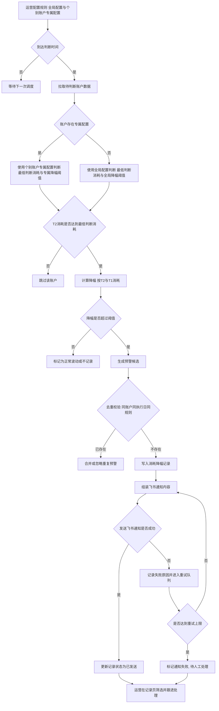

# 广告账户消耗下降提醒系统 PRD

## 1. 需求背景 & 目标

### 1.1 需求背景
- 当前广告账户消耗波动依赖人工巡检, 对`T-2`到`T-1`的大幅下滑识别不及时.
- 原有页面仅支持最低判断消耗配置, 对“降幅阈值”缺乏统一口径.
- 业务希望同时支持全局配置和账户专属配置, 以适配不同客户和账户体量.
- 运维阶段需要统一查看异常记录并做跟进闭环.

### 1.2 需求目标
- 建立统一预警规则: 当`T-2`消耗满足最低判断消耗, 且`T-2 -> T-1`降幅超过阈值时触发预警.
- 支持两级阈值策略:
  - 全局基础配置支持`降幅阈值`.
  - 个别账户专属配置支持覆盖`降幅阈值`.
- 消耗降幅记录页面支持筛选, 处理, 跟进, 导出.
- 暂时隐藏推送日志模块入口, 聚焦配置和记录闭环.
- 记录列表中`商务`和`运营`分开展示, 提升职责识别效率.

### 1.3 成功标准
- 配置层: 可完成全局阈值和账户专属阈值的新增, 编辑, 保存, 展示.
- 记录层: 运营可在1个页面内完成筛选与处理, 批量处理可用.
- 预警规则口径统一: 页面文案和数据展示一致使用“降幅阈值”.

## 2. 功能流程图 (Markdown)



## 3. 功能列表

| 功能模块 | 功能点 | 说明 |
|---|---|---|
| 配置 | 全局基础配置 | 维护全局最低判断消耗, 全局降幅阈值, 每日执行时间, 总开关 |
| 配置 | 个别账户专属配置 | 对单账户覆盖最低判断消耗和降幅阈值, 同一账户仅保留1条, 支持列表筛选 |
| 记录 | 消耗降幅记录 | 查看异常记录, 多维筛选, 单条/批量处理, 导出 |
| 页面控制 | 推送日志模块隐藏 | 当前版本隐藏Tab入口, 不开放给业务使用 |
| 数据展示 | 商务与运营拆列 | 记录列表将`商务负责人`和`运营负责人`分开展示 |
| 页面交互 | 顶部统一保存按钮移除 | 页面级右上角不再提供统一保存入口, 统一通过各模块弹窗保存 |

## 4. 功能详述

### 4.1 功能点1: 全局基础配置

#### 页面作用简介
- 用于维护系统默认预警规则, 为所有账户提供基础判断标准.
- 当账户无专属配置时, 使用全局配置参与预警判断.
- 页面级右上角不提供统一保存按钮, 通过本模块`编辑弹窗`保存生效.

#### 页面位置
- 菜单路径: `系统设置 -> 消耗下降提醒配置`
- 页面区域: `配置`Tab下`全局基础配置`卡片 + 编辑弹窗.

#### 筛选字段
- 无.

#### 列表字段
| 字段名 | 类型 | 说明 |
|---|---|---|
| 全局最低判断消耗(元) | number | 仅当`T-2`消耗大于等于该值时, 才进入降幅判断 |
| 全局降幅阈值(%) | integer | 当`(T-2 - T-1) / T-2 * 100`超过该值时触发预警 |
| 每日执行时间 | time | 系统每日任务执行时间 |
| 提醒功能总开关 | enum(enabled/disabled) | 控制是否启用提醒策略 |
| 更新时间 | datetime | 最近一次全局配置更新时间 |
| 更新人 | string | 最近一次修改人 |

#### 页面功能点
- 交互:
  - 点击`编辑`打开弹窗.
  - 填写`全局最低判断消耗`, `全局降幅阈值`, `每日执行时间`, `提醒功能总开关`.
  - 点击`保存`后回写展示区.
- 效果:
  - 展示区实时显示最新配置值.
  - 保存成功后给出成功提示.
- 处理逻辑:
  - 校验规则:
    - 全局最低判断消耗: `1-1000`整数.
    - 全局降幅阈值: `1-99`整数.
    - 每日执行时间必填.
    - 开关值仅允许`enabled/disabled`.
  - 保存后更新`更新时间`和`更新人`.

### 4.2 功能点2: 个别账户专属配置

#### 页面作用简介
- 对重点账户进行规则覆盖, 支持按账户自定义最低判断消耗和降幅阈值.
- 专属配置优先级高于全局配置.

#### 页面位置
- 菜单路径: `系统设置 -> 消耗下降提醒配置`
- 页面区域: `配置`Tab下`个别账户专属配置`卡片 + 添加/编辑弹窗.

#### 筛选字段
| 字段名 | 类型 | 默认值 | 说明 |
|---|---|---|---|
| 媒体 | enum | `全部` | 按媒体类型筛选专属配置 |
| 广告账户ID | string | 空 | 模糊匹配账户ID |
| 广告账户名称 | string | 空 | 模糊匹配账户名称 |

#### 列表字段
| 字段名 | 类型 | 说明 |
|---|---|---|
| 媒体 | enum | 账户所属媒体, 如`Facebook/Google/TikTok` |
| 账户ID | string | 广告账户唯一标识 |
| 账户名称 | string | 广告账户名称 |
| 最低判断消耗(元) | number | 专属最低判断消耗 |
| 降幅阈值(%) | integer | 专属降幅阈值, 用于覆盖全局值 |
| 更新时间 | datetime | 最近一次配置更新时间 |
| 更新人 | string | 最近一次修改人 |
| 操作 | action | 支持编辑 |

#### 页面功能点
- 交互:
  - 通过筛选区输入`媒体`,`广告账户ID`,`广告账户名称`后点击`搜索`刷新列表.
  - 点击`重置`恢复默认筛选条件并刷新列表.
  - 点击`添加`打开弹窗.
  - 先选媒体, 再通过输入框模糊搜索账户并选择.
  - 填写最低判断消耗和降幅阈值后保存.
  - 点击列表`编辑`可修改已存在配置.
- 效果:
  - 筛选命中时仅展示匹配记录.
  - 筛选无结果时展示空状态提示.
  - 新增后列表新增记录.
  - 若同账户已存在配置, 新保存结果覆盖原配置.
  - 编辑态账户不可变更, 避免主键漂移.
- 处理逻辑:
  - 列表筛选逻辑:
    - 媒体: 精确匹配.
    - 广告账户ID: 模糊匹配.
    - 广告账户名称: 模糊匹配.
  - 校验规则:
    - 账户必须已选择.
    - 最低判断消耗: `1-1000`整数.
    - 降幅阈值: `1-99`整数.
  - 同一`accountId`仅保留1条记录.
  - 保存后更新`更新时间`和`更新人`.

### 4.3 功能点3: 消耗降幅记录

#### 页面作用简介
- 提供异常记录查询与处理闭环.
- 支持筛选, 单条处理, 批量处理, 导出.

#### 页面位置
- 菜单路径: `系统设置 -> 消耗下降提醒配置`
- 页面区域: `消耗降幅记录`Tab.

#### 筛选字段
| 字段名 | 类型 | 默认值 | 说明 |
|---|---|---|---|
| 日期范围-开始 | date | `2026-03-01` | 查询执行日期起始 |
| 日期范围-结束 | date | `2026-03-25` | 查询执行日期结束 |
| 客户名称 | string | 空 | 模糊匹配客户 |
| 商务负责人 | enum | `全部` | 按商务负责人筛选 |
| 运营负责人 | enum | `全部` | 按运营负责人筛选 |
| 投放平台 | enum | `全部` | 按平台筛选 |
| 处理状态 | enum | `全部` | 按处理状态筛选 |
| 账户ID/名称 | string | 空 | 模糊匹配账户ID或账户名 |

#### 列表字段
| 字段名 | 类型 | 说明 |
|---|---|---|
| 全选/勾选 | checkbox | 支持单选与全选, 用于批量处理 |
| 执行日期 | date | 任务执行日期 |
| 客户名称 | string | 客户名称 |
| 商务负责人 | string | 商务owner, 独立列展示 |
| 运营负责人 | string | 运营owner, 独立列展示 |
| 投放平台 | enum | 平台信息 |
| 广告账户ID | string | 账户唯一标识 |
| 广告账户名称 | string | 账户名称 |
| T-2消耗 | number(currency) | 前天消耗金额 |
| T-1消耗 | number(currency) | 昨日消耗金额 |
| 降幅 | string/percent | 降幅比例或归零标识 |
| 适用阈值 | string | 标识命中的是全局阈值或专属阈值 |
| 处理状态 | enum | 未处理/已跟进/正常波动/已解决 |
| 处理时间 | datetime | 记录处理时间 |
| 处理人员 | string | 记录处理人 |
| 备注 | string | 跟进备注 |
| 操作 | action | 单条`处理`入口 |

#### 页面功能点
- 交互:
  - 点击`搜索`按筛选条件刷新列表.
  - 勾选记录后显示`批量处理`按钮.
  - 点击单条`处理`或`批量处理`打开处理弹窗.
  - 在处理弹窗选择状态并填写备注后保存.
- 效果:
  - 保存后对应记录更新状态, 处理时间, 处理人, 备注.
  - 批量保存后清空已选中项.
  - 支持导出Excel(当前为示例行为占位).
- 处理逻辑:
  - 单条处理: 仅更新当前记录.
  - 批量处理: 更新所有选中记录.
  - 状态徽标按状态值渲染不同颜色.

### 4.4 功能点4: 推送日志模块暂时隐藏

#### 页面作用简介
- 当前阶段暂不对业务开放推送日志能力入口, 避免干扰主流程.

#### 页面位置
- 菜单路径: `系统设置 -> 消耗下降提醒配置`
- 页面区域: 顶部Tab栏中的`推送日志`入口.

#### 筛选字段
- 不适用.

#### 列表字段
- 不适用.

#### 页面功能点
- 交互:
  - 用户在Tab栏不可见`推送日志`入口.
- 效果:
  - 页面仅保留`配置`与`消耗降幅记录`两个主操作区域.
- 处理逻辑:
  - 通过前端隐藏Tab按钮控制入口可见性.

### 4.5 功能点5: 触发预警时的飞书通知内容

#### 页面作用简介
- 当账户命中消耗下降预警规则时, 系统向飞书发送结构化通知, 便于BD和AM第一时间跟进.

#### 页面位置
- 页面无直接配置入口.
- 触发时机: 预警任务执行并命中规则后, 由通知服务自动发送.

#### 筛选字段
- 不适用.

#### 列表字段
| 字段名 | 类型 | 说明 |
|---|---|---|
| 客户名称 | string | 预警归属客户 |
| 投放平台 | enum | 账户所属平台, 如Facebook/Google/TikTok |
| 广告账户ID | string | 账户唯一标识 |
| 广告账户名称 | string | 账户名称 |
| 对比日期 | string | 展示T-2日期与T-1日期 |
| T-2消耗 | number(currency) | 对比期前天消耗 |
| T-1消耗 | number(currency) | 对比期昨天消耗 |
| 降幅 | percent | 按统一公式计算后的降幅 |
| 命中阈值 | string | 本次命中阈值来源与阈值值, 如专属35%/全局30% |
| 接收人BD | mention/list | 对应BD飞书用户, 消息中需@ |
| 接收人AM | mention/list | 对应AM飞书用户, 消息中需@ |

#### 页面功能点
- 交互:
  - 命中预警后自动发送飞书消息, 无人工点击动作.
  - 消息内显式@对应BD和AM.
- 效果:
  - 接收人可在同一条消息中看到客户, 账户, 对比消耗, 降幅, 阈值来源.
  - BD和AM可直接据此进行排查和跟进.
- 处理逻辑:
  - 接收人映射: 基于账户绑定关系获取对应BD和AM的飞书用户ID.
  - 消息去重: 同账户同执行日同规则仅发1条有效预警.
  - 消息内容必须包含客户信息, 账户信息, 对比天数消耗, 降幅, 阈值来源.

#### 飞书通知消息模板(建议)
```text
[消耗下降预警]
客户: {customerName}
平台: {platform}
广告账户: {accountName} ({accountId})
对比日期: T-2({t2Date}) vs T-1({t1Date})
T-2消耗: {t2Consumption}
T-1消耗: {t1Consumption}
降幅: {declineRate}
命中阈值: {thresholdSource}
请及时跟进处理: @BD({bdName}) @AM({amName})
```

## 5. 规则说明 (技术口径)

- 预警判定建议统一公式:
  - `declineRate = (T-2消耗 - T-1消耗) / T-2消耗 * 100`
  - 当`T-2消耗 >= 最低判断消耗`且`declineRate > 降幅阈值`时触发预警.
- 阈值优先级:
  - 若账户存在专属配置, 使用专属`最低判断消耗 + 降幅阈值`.
  - 否则使用全局配置.

## 6. 非目标范围

- 本期不包含真实消息推送重试链路设计.
- 本期不包含后端接口定义与数据库DDL设计.
- 本期不包含推送日志可视化分析能力.
