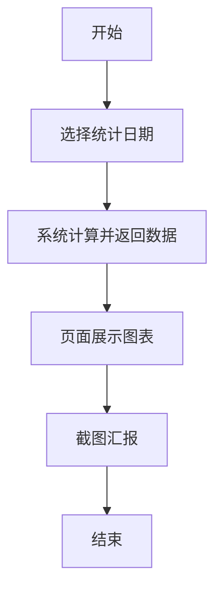
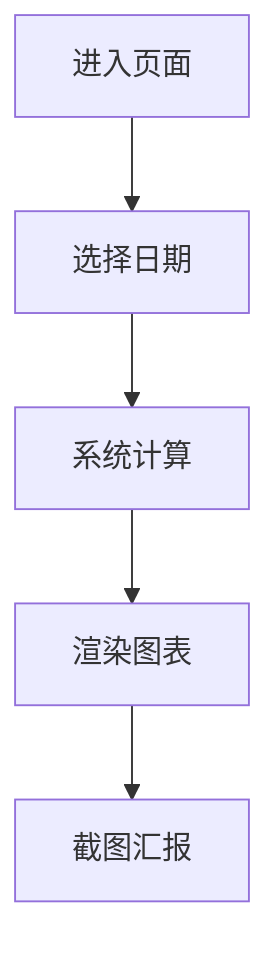
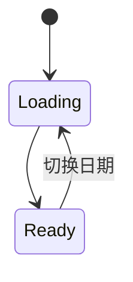

# 广告日报 PRD

## 1. 修订历史记录

| 文档版本号 | 日期 | AMD | 修订者 | 审核人 | 修订内容 | 修订原因 |
| --- | --- | --- | --- | --- | --- | --- |
| 0.1 | 2026-05-08 | A | AI助手 | 待定 | 首版 | 新增广告日报图表页 |
| 0.2 | 2026-05-08 | M | AI助手 | 待定 | 精简文档 | 按业务诉求保留最小必要信息 |

(A-添加, M-修改, D-删除)

## 2. 需求背景&目标

### 2.1 需求背景

- 业务需要按日期查看广告日报图表, 并截图给老板汇报.
- 重点是看图表结果和关键数字, 不涉及复杂人工流程.

### 2.2 需求目标

- 提供单页图表展示, 支持按日期筛选.
- 页面支持浅色/深色切换.
- 图表静态可读性高, 适合截图汇报.

## 3. 系统全景图

## 4. 全局流程图

### 4.1 业务流程图

### 4.2 业务实体关系

略

### 4.3 系统流程图

略

## 5. 功能清单&版本规划

| 系统 | 模块 | 页面 | 功能点 | 优先级 | 版本号 |
| --- | --- | --- | --- | --- | --- |
| Admin | 报表分析 | `reports/ad-daily-report.html` | 按日期渲染广告日报图表 | P0 | V1.0 |
| Admin | 报表分析 | `reports/ad-daily-report.html` | 浅色/深色主题切换 | P0 | V1.0 |
| Admin | 报表分析 | `reports/ad-daily-report.html` | 截图友好的标签与金额展示 | P0 | V1.0 |

---

## 6. 系统A(Admin)

### 6.1 模块a(广告日报图表页)

#### 6.1.1 名词解释

| 名词 | 定义 | 举例/说明 |
| --- | --- | --- |
| 统计日期 | 报表查询日期 | `2026-05-03` |
| 商户ID | 客户唯一身份证ID | `12345` |
| 活跃客户 | 当天有广告消耗的客户 | 当日消耗 > 0 |

#### 6.1.2 流程图

#### 6.1.3 状态机

##### 6.1.3.1 状态流转图

##### 6.1.3.2 状态——可执行的操作

| 状态 | 角色 | 可执行操作 | 前置/约束条件 | 执行结果(后置状态) | 批量操作 |
| --- | --- | --- | --- | --- | --- |
| Loading | 业务 | 等待加载 | 已选择日期 | Ready | 否 |
| Ready | 业务 | 查看并截图 | 图表已渲染 | Ready | 否 |

#### 6.1.4 原型

- 页面: `admin-system/reports/ad-daily-report.html`.
- 左侧: Top客户当日消耗排行.
- 中部: 每日充值柱图, 账户类型消耗占比环图, 新老客户占比环图.
- 右侧: KPI大数字卡片.

#### 6.1.5 功能说明

##### 6.1.5.1 筛选项

| 序号 | 筛选项 | 说明 |
| --- | --- | --- |
| 1 | 统计日期 | 按日筛选, 默认昨天 |
| 2 | 主题模式 | 浅色/深色切换 |

##### 6.1.5.2 列表字段说明

| 序号 | 字段名称 | 说明 |
| --- | --- | --- |
| 1 | 排名 | 从1开始 |
| 2 | 客户名称(商户ID) | 格式 `客户名称(商户ID)` |
| 3 | 当日消耗金额 | 金额展示, 保留2位小数 |

##### 6.1.5.3 排序规则

- Top客户排行按当日消耗金额降序.

##### 6.1.5.4 交互说明

- 客户名称(商户ID)过长时省略显示, tooltip可看完整值.
- 账户类型占比图取消右侧图例, 使用引导线外标签显示 `名称+金额+占比`.
- 账户类型占比图长尾项可合并为 `其他`, 避免标签过密.
- 各图表尽量直接展示关键数值, 降低截图后的阅读门槛.

##### 6.1.5.5 操作

- 选择日期后自动刷新图表.
- 页面可直接截图用于汇报.

---

### 6.2 模块a(指标口径)

#### 6.2.1 名词解释

| 名词 | 定义 | 举例/说明 |
| --- | --- | --- |
| 渠道消耗占比 | 渠道消耗/总消耗 | 56.6% |
| 新老客户占比 | 新或老客户消耗/总消耗 | 新客户 7.45% |

#### 6.2.2 流程图

略

#### 6.2.3 状态机

略

#### 6.2.4 原型

略

#### 6.2.5 功能说明

##### 6.2.5.1 筛选项

| 序号 | 筛选项 | 说明 |
| --- | --- | --- |
| 1 | 统计日期 | 统一作用于所有图表 |

##### 6.2.5.2 列表字段说明

| 序号 | 字段名称 | 说明 |
| --- | --- | --- |
| 1 | 渠道名称 | 账户类型或渠道名称 |
| 2 | 渠道消耗金额 | 统计日期该渠道总消耗 |
| 3 | 渠道占比 | 渠道消耗/当日总消耗 |
| 4 | 其他渠道汇总 | 长尾渠道可合并到 `其他` |

##### 6.2.5.3 排序规则

- 渠道占比图按金额降序绘制.

##### 6.2.5.4 交互说明

- 默认展示引导线标签和占比.

##### 6.2.5.5 操作

略

---

## 7. 系统B(Client)

### 7.x 模块a

略

---

## 角色与权限

| 角色名称 | 职能描述 | 页面/功能权限 | 数据权限范围 |
| --- | --- | --- | --- |
| 业务/运营 | 查看日报并截图汇报 | 查看页面, 切换日期, 切换主题 | 全量 |

## 非功能性需求

### 业务数据迁移方案

略

### 数据需求

| 指标 | 计算口径 | 数据源 | 加工公式 | 指标更新周期 |
| --- | --- | --- | --- | --- |
| 月累计充值 | 月初至统计日期累计充值 | 充值明细 | `sum(recharge_amount)` | T+1 |
| 当日充值金额 | 统计日期充值总额 | 充值明细 | `sum(recharge_amount where date=统计日期)` | T+1 |
| 当日消耗金额 | 统计日期消耗总额 | 消耗明细 | `sum(consume_amount where date=统计日期)` | T+1 |
| 当日预计利润 | 统计日期预计利润总额 | 利润明细 | `sum(estimated_profit where date=统计日期)` | T+1 |
| 当天活跃客户数 | 统计日期消耗大于0的去重客户数 | 消耗明细 | `count(distinct customer_id)` | T+1 |
| 近30天活跃客户数 | 近30天消耗大于0的去重客户数 | 消耗明细 | `count(distinct customer_id in 30d)` | T+1 |

### 埋点需求

略

## 附录

### 产品调研报告

略

### 项目资料

略

### 设计稿

略

### 技术方案

略

### API文档

略

### 操作手册

略
