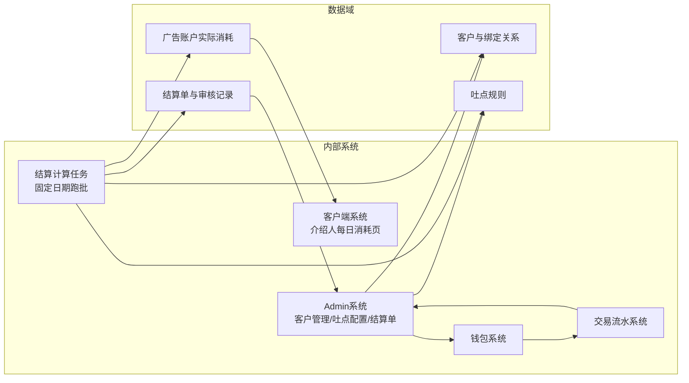
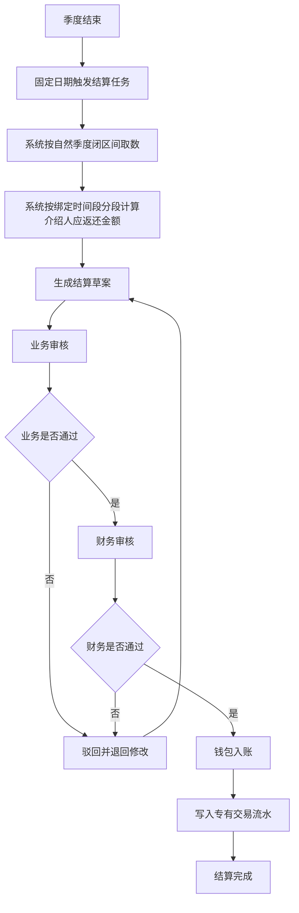
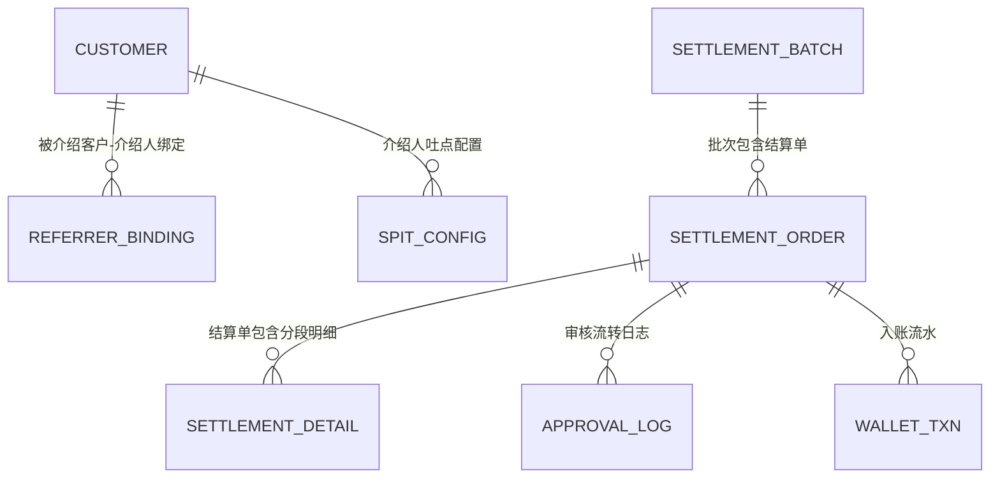
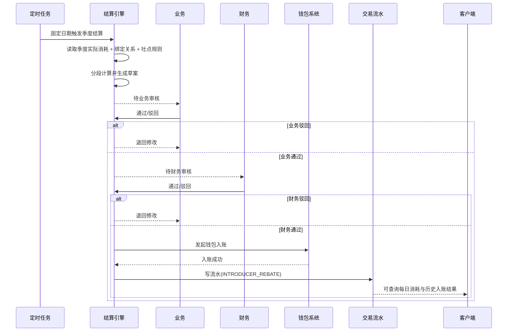
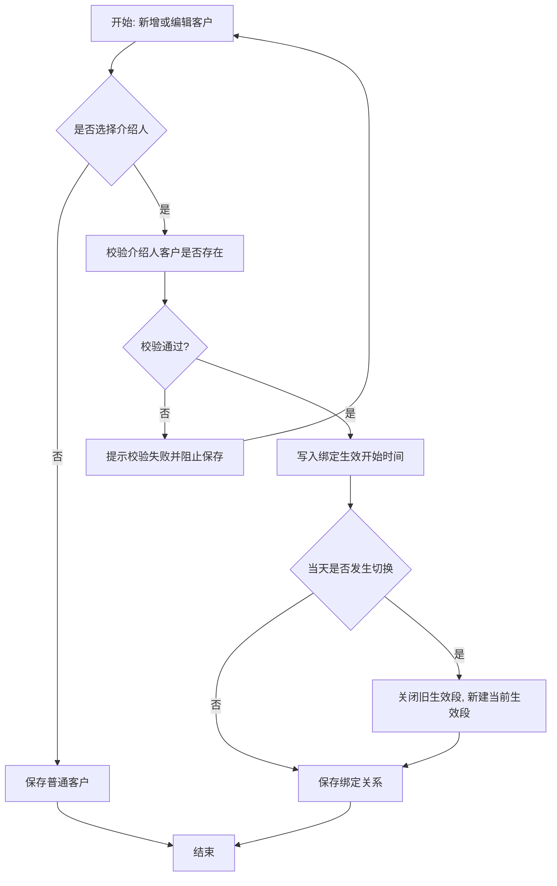
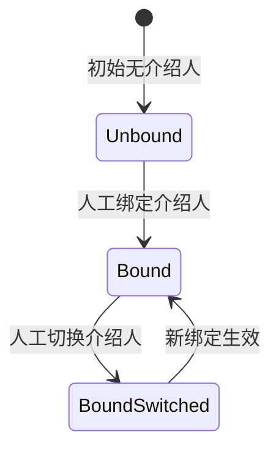
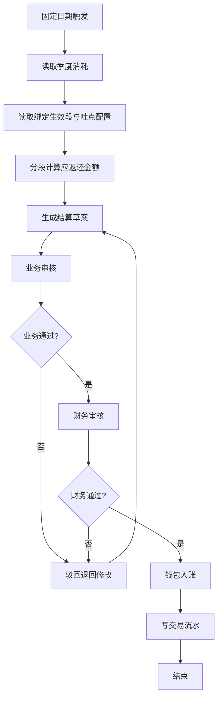
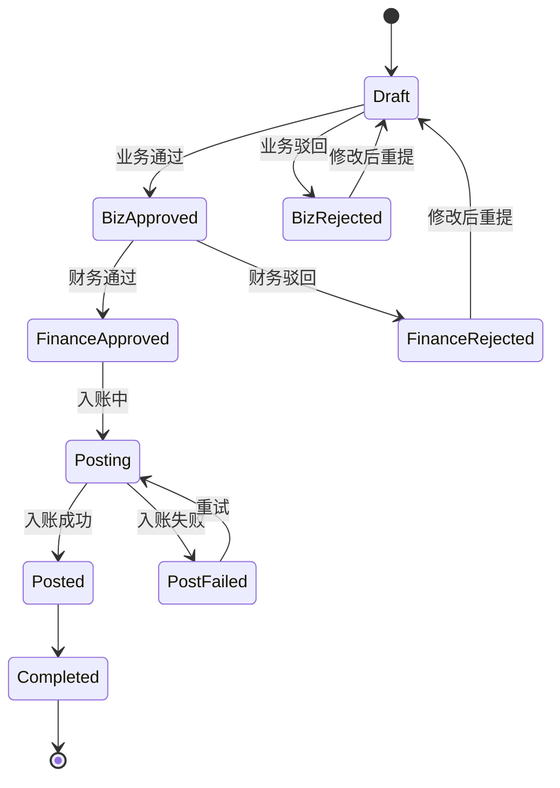
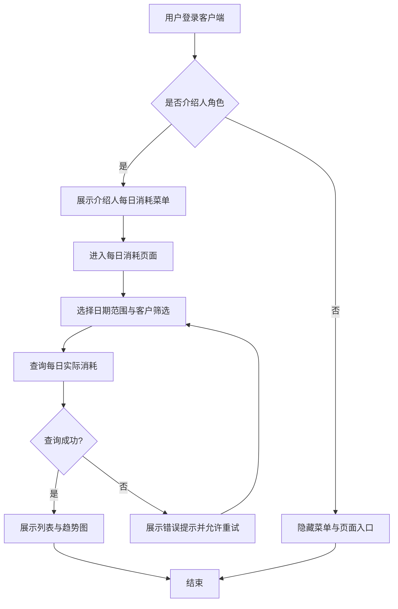
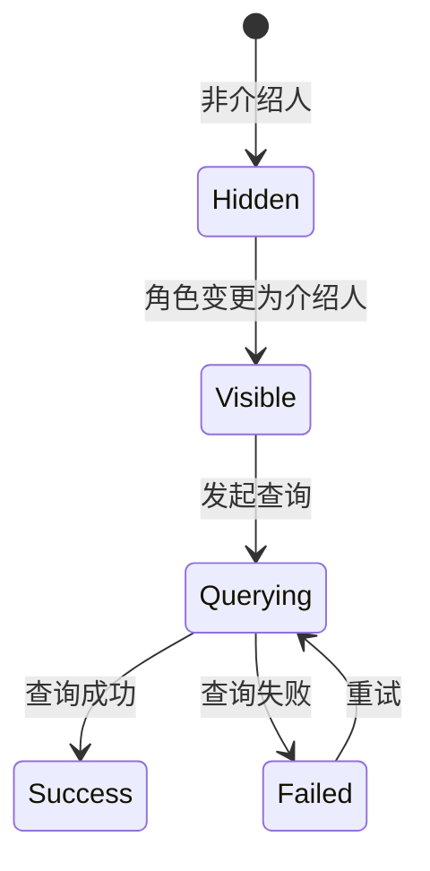

# 介绍人与吐点需求 PRD

## 1. 修订历史记录

| 文档版本号 | 日期 | AMD | 修订者 | 审核人 | 修订内容 | 修订原因 |
| --- | --- | --- | --- | --- | --- | --- |
| 0.1 | 2026-05-06 | A | AI助手 | 待定 | 首版 | 新增介绍人与吐点季度结算能力 |

(A-添加, M-修改, D-删除)

## 2. 需求背景&目标

### 2.1 需求背景

- 当前系统已有客户来源和介绍人文本字段, 但介绍人是自由文本, 无法建立可结算的强关联关系.
- 当前返点配置偏向广告账户与客户返点场景, 缺少介绍人维度的吐点规则与周期结算闭环.
- 业务需要在固定时间产出季度吐点结算草案, 先业务确认, 再财务确认, 最后入账到介绍人钱包.
- 客户端侧, 介绍人希望看到自己带来客户的每日广告消耗, 但不需要看到吐点比例和预期收益.
- 受众群体: 运营, 财务, 管理员, 介绍人角色客户.

### 2.2 需求目标

- 定性目标:
  - 建立介绍人-被介绍客户强关联模型.
  - 支持介绍人吐点规则配置, 按时间段分段计算.
  - 建立季度固定时间出数, 业务/财务双审核, 钱包入账, 流水留痕的闭环.
  - 在客户端提供仅介绍人可见的每日消耗视图.
- 定量目标:
  - 100% 结算单支持追溯到客户分段明细.
  - 100% 吐点入账流水具备独立交易类型 `INTRODUCER_REBATE`.
  - 固定在季度结束后 1.5 个月的日期产出草案, 示例: 2026Q1 于 2026-05-15 产出.

## 3. 系统全景图

## 4. 全局流程图

### 4.1 业务流程图

### 4.2 业务实体关系

### 4.3 系统流程图

## 5. 功能清单&版本规划

| 系统 | 模块 | 页面 | 功能点 | 优先级 | 版本号 |
| --- | --- | --- | --- | --- | --- |
| Admin | 介绍人关系管理 | `main-functions/customer-management.html` | 介绍人强关联绑定, 生效时间段管理, 同日切换归属规则 | P0 | V1.0 |
| Admin | 吐点规则管理 | `main-functions/rebate-config.html` | 新增介绍人吐点配置Tab, 比例与生效时间配置 | P0 | V1.0 |
| Admin | 结算管理 | `reports/introducer-settlement.html` | 固定日期草案, 业务审核, 财务审核, 驳回退回修改, 入账触发 | P0 | V1.0 |
| Admin | 流水管理 | `customer-transactions/transaction-detail.html` | 新增交易类型 `INTRODUCER_REBATE`, 可筛选可追溯 | P0 | V1.0 |
| Admin | 报表分析 | `reports/introducer-rebate-report.html` | 介绍人吐点汇总与明细报表 | P1 | V1.1 |
| Client | 角色化菜单 | `bestads-client-styled/components/sidebar.html` | 仅介绍人角色显示每日消耗菜单 | P0 | V1.0 |
| Client | 每日消耗查看 | `bestads-client-styled/introducer-daily-consume.html` | 查看被介绍客户每日广告消耗, 不展示吐点与收益 | P0 | V1.0 |
| Client | 首页入口 | `bestads-client-styled/index.html` | 介绍人首页快捷入口 | P1 | V1.1 |

---

## 6. 系统A(Admin)

### 6.1 模块a(介绍人关系管理)

#### 6.1.1 名词解释

| 名词 | 定义 | 举例/说明 |
| --- | --- | --- |
| 介绍人 | 在客户体系中可获得吐点返还的客户角色 | 客户A介绍客户C |
| 被介绍客户 | 与介绍人建立绑定关系, 其消耗参与吐点计算的客户 | 客户C |
| 绑定生效段 | 介绍人与被介绍客户关系生效的时间区间 | `2026-02-03 15:00:00` 起 |

#### 6.1.2 流程图

#### 6.1.3 状态机

##### 6.1.3.1 状态流转图

##### 6.1.3.2 状态——可执行的操作

| 状态 | 角色 | 可执行操作 | 前置/约束条件 | 执行结果(后置状态) | 批量操作 |
| --- | --- | --- | --- | --- | --- |
| Unbound | 运营 | 绑定介绍人 | 介绍人客户存在 | Bound | 否 |
| Bound | 运营 | 修改介绍人 | 需记录生效时间 | BoundSwitched | 否 |
| BoundSwitched | 系统 | 生效新关系 | 当前时间到达 | Bound | 否 |

#### 6.1.4 原型

- 使用现有客户管理页面新增字段区块.
- 支持空态: 无介绍人时展示 `--`.
- 支持异常提示: 介绍人不存在, 生效时间非法.

#### 6.1.5 功能说明

##### 6.1.5.1 筛选项

| 序号 | 筛选项 | 说明 |
| --- | --- | --- |
| 1 | 客户ID/名称 | 模糊搜索 |
| 2 | 是否介绍人 | 下拉: 全部/是/否 |
| 3 | 介绍人ID/名称 | 模糊搜索 |

##### 6.1.5.2 列表字段说明

| 序号 | 字段名称 | 说明 |
| --- | --- | --- |
| 1 | 客户ID | 左对齐, 空值`--` |
| 2 | 客户名称 | 左对齐 |
| 3 | 介绍人ID | 左对齐 |
| 4 | 介绍人名称 | 左对齐 |
| 5 | 绑定开始时间 | 时间格式 |
| 6 | 绑定结束时间 | 空值表示当前生效 |

##### 6.1.5.3 排序规则

- 默认按更新时间降序.
- 支持按客户ID, 更新时间排序.

##### 6.1.5.4 交互说明

- 点击编辑弹窗更新绑定关系.
- 生效时间冲突时弹出错误提示.

##### 6.1.5.5 操作

- 单条操作: 绑定介绍人, 修改介绍人.
- 高风险操作(切换介绍人)需二次确认.

---

### 6.2 模块a(介绍人吐点配置与结算)

#### 6.2.1 名词解释

| 名词 | 定义 | 举例/说明 |
| --- | --- | --- |
| 吐点比例 | 介绍人返还比例 | 2.5% |
| 自然季度闭区间 | 统计季度固定边界 | Q1: `01-01 00:00:00` 到 `03-31 23:59:59` |
| 结算草案 | 系统计算后的待审核结算数据 | 2026Q1草案 |

#### 6.2.2 流程图

#### 6.2.3 状态机

##### 6.2.3.1 状态流转图

##### 6.2.3.2 状态——可执行的操作

| 状态 | 角色 | 可执行操作 | 前置/约束条件 | 执行结果(后置状态) | 批量操作 |
| --- | --- | --- | --- | --- | --- |
| Draft | 业务 | 通过, 驳回 | 结算单完整 | BizApproved 或 BizRejected | 是 |
| BizApproved | 财务 | 通过, 驳回 | 业务已通过 | FinanceApproved 或 FinanceRejected | 是 |
| FinanceApproved | 系统 | 入账 | 钱包服务可用 | Posting | 是 |
| PostFailed | 系统/管理员 | 重试入账 | 幂等校验通过 | Posting | 是 |

#### 6.2.4 原型

- 页面: `introducer-settlement.html`.
- 分区: 查询区, 汇总表, 明细抽屉, 审核弹窗.
- 空态: 无草案数据时展示空态卡片.
- 异常态: 入账失败显示失败原因与重试按钮.

#### 6.2.5 功能说明

##### 6.2.5.1 筛选项

| 序号 | 筛选项 | 说明 |
| --- | --- | --- |
| 1 | 年度 | 精确筛选 |
| 2 | 季度 | `Q1/Q2/Q3/Q4` |
| 3 | 介绍人关键词 | 模糊搜索介绍人名称或ID |
| 4 | 审核状态 | 全部/待业务/待财务/已完成/已驳回 |

##### 6.2.5.2 列表字段说明

| 序号 | 字段名称 | 说明 |
| --- | --- | --- |
| 1 | 结算单ID | 可点击查看明细 |
| 2 | 介绍人 | 名称+ID |
| 3 | 被介绍客户数 | 数值右对齐 |
| 4 | 实际消耗总额 | 金额右对齐 |
| 5 | 吐点比例 | 百分比展示 |
| 6 | 应返还金额 | 金额右对齐 |
| 7 | 调整金额 | 可正可负 |
| 8 | 最终返还金额 | 金额右对齐 |
| 9 | 业务状态 | 徽标展示 |
| 10 | 财务状态 | 徽标展示 |

##### 6.2.5.3 排序规则

- 默认按结算单更新时间降序.
- 支持按实际消耗, 应返还金额, 最终返还金额排序.

##### 6.2.5.4 交互说明

- 点击结算单ID打开明细抽屉.
- 点击审核按钮弹出审核弹窗.
- 驳回必须填写原因.

##### 6.2.5.5 操作

- 单条: 业务通过/驳回, 财务通过/驳回, 重试入账.
- 批量: 批量业务通过, 批量财务通过.
- 二次确认: 财务通过并触发入账时必须二次确认.

---

## 7. 系统B(Client)

### 7.1 模块a(介绍人每日消耗查看)

#### 7.1.1 名词解释

| 名词 | 定义 | 举例/说明 |
| --- | --- | --- |
| 介绍人角色 | 客户端当前登录用户具备介绍人身份 | `isIntroducerRole=true` |
| 每日消耗 | 被介绍客户在某日的广告账户实际消耗 | 2026-05-14 消耗 4580.20 |

#### 7.1.2 流程图

#### 7.1.3 状态机

##### 7.1.3.1 状态流转图

##### 7.1.3.2 状态——可执行的操作

| 状态 | 角色 | 可执行操作 | 前置/约束条件 | 执行结果(后置状态) | 批量操作 |
| --- | --- | --- | --- | --- | --- |
| Hidden | 非介绍人客户 | 无 | 无 | Hidden | 否 |
| Visible | 介绍人客户 | 发起查询 | 选择日期范围 | Querying | 否 |
| Success | 介绍人客户 | 调整筛选后重查 | 日期合法 | Querying | 否 |
| Failed | 介绍人客户 | 重试查询 | 网络恢复 | Querying | 否 |

#### 7.1.4 原型

- 页面: `bestads-client-styled/introducer-daily-consume.html`.
- 内容: 查询区, 指标卡, 每日消耗列表, 趋势图.
- 约束: 严禁展示吐点比例, 预期收益, 结算金额等字段.

#### 7.1.5 功能说明

##### 7.1.5.1 筛选项

| 序号 | 筛选项 | 说明 |
| --- | --- | --- |
| 1 | 开始日期 | 日期选择 |
| 2 | 结束日期 | 日期选择 |
| 3 | 被介绍客户关键词 | 模糊搜索 |

##### 7.1.5.2 列表字段说明

| 序号 | 字段名称 | 说明 |
| --- | --- | --- |
| 1 | 日期 | `YYYY-MM-DD` |
| 2 | 被介绍客户ID | 文本 |
| 3 | 被介绍客户名称 | 文本 |
| 4 | 媒体 | 文本 |
| 5 | 广告账户ID | 文本 |
| 6 | 广告账户名称 | 文本 |
| 7 | 每日消耗金额 | 金额右对齐 |

##### 7.1.5.3 排序规则

- 默认按日期降序.
- 支持按日期, 每日消耗金额排序.

##### 7.1.5.4 交互说明

- 菜单展示与隐藏按角色实时控制.
- 查询失败时展示错误提示与重试按钮.

##### 7.1.5.5 操作

- 查询, 重置筛选.
- 不提供导出收益类数据.

### 7.x 模块a

略

---

## 角色与权限

| 角色名称 | 职能描述 | 页面/功能权限 | 数据权限范围 |
| --- | --- | --- | --- |
| 运营 | 维护关系与规则, 业务审核 | 客户管理, 返点配置, 结算审核(业务) | 全量 |
| 财务 | 审核结算并确认入账 | 结算审核(财务), 入账确认 | 全量 |
| 管理员 | 监控与异常处理 | 全部页面, 重试入账 | 全量 |
| 介绍人客户 | 查看自己带来客户的每日消耗 | 客户端每日消耗页(仅介绍人可见) | 仅自己关联客户 |
| 非介绍人客户 | 普通客户功能 | 不可见每日消耗介绍人页面 | 自身基础数据 |

## 非功能性需求

### 业务数据迁移方案

- 迁移范围: 现有客户表中的 `referrer` 文本迁移为结构化绑定关系.
- 映射规则: 先按商户ID/客户名做映射, 无法映射的数据进入人工补录池.
- 清洗规则: 去重同义写法, 处理空值与不存在介绍人.
- 校验机制: 迁移前后客户总数一致, 可识别介绍人关系覆盖率可统计.
- 回滚策略: 保留原文本字段只读备份, 失败时回切读旧字段.

### 数据需求

| 指标 | 计算口径 | 数据源 | 加工公式 | 指标更新周期 |
| --- | --- | --- | --- | --- |
| 介绍人季度应返还金额 | 季度内分段消耗 * 吐点比例汇总 | 消耗明细+绑定关系+配置规则 | `sum(segment_consume * rate)` | T+季度固定日 |
| 客户端每日消耗金额 | 被介绍客户日维度实际消耗 | 广告消耗明细 | `sum(account_daily_consume)` | T+1 |
| 吐点入账金额 | 审核通过后的最终返还金额 | 结算单+钱包流水 | `final_return_amount` | 实时 |

### 埋点需求

略

## 附录

### 产品调研报告

略

### 项目资料

略

### 设计稿

略

### 技术方案

略

### API文档

略

### 操作手册

略

