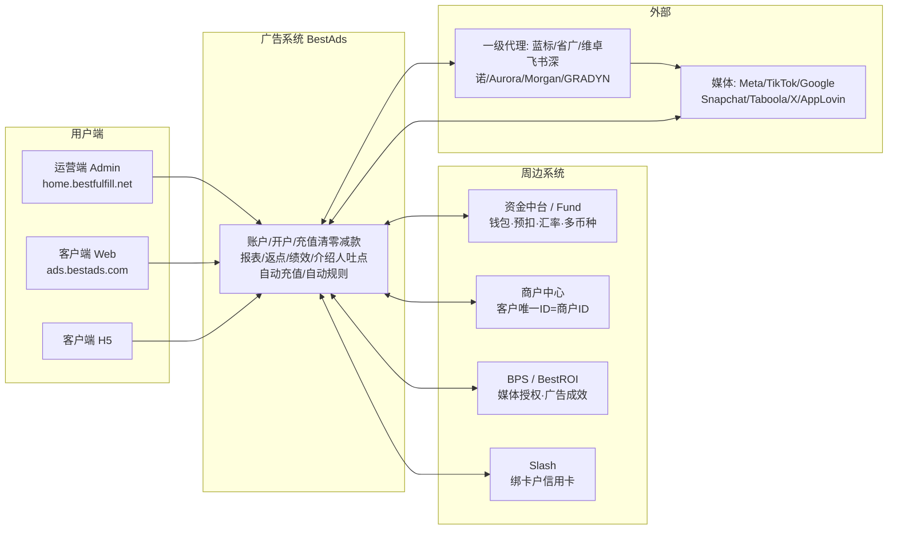
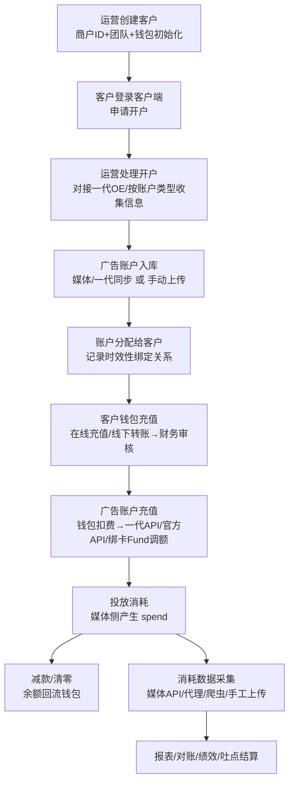

# BestAds 广告系统 · 项目概述

> 本文基于飞书知识库「广告 / 广告媒体&代理 / 需求文档」下 62 篇 PRD（V1.0 → V3.0，作者 @欧伟权）梳理而成，用于快速了解项目全貌。
> 生成日期：2026-06-09 ｜ 数据源：`PRD/飞书同步/广告/广告媒体&代理/需求文档/`

---

## 一、项目是什么

**BestAds 是一套面向跨境电商/广告客户的「广告代理商 SaaS + 资金管理」系统。**

公司（BestFulfill）作为 Facebook、TikTok、Google 等媒体的**广告代理商**，通过对接多家一级代理（蓝标、省广、维卓、飞书深诺等）获取广告账户资源，分配给客户使用，并围绕账户提供**开户、充值、清零、减款、消耗数据、对账、绩效、返佣**等全链路服务。系统本质上做三件事：

1. **账户与资源调度** —— 把"一代/媒体的广告账户"变成"可分配、可计费、可监控"的内部资产；
2. **资金闭环** —— 客户打款进钱包 → 钱包扣费给广告账户充值 → 余额清零/减款回流钱包，全程与「资金中台」对账；
3. **数据与经营** —— 把多媒体的消耗数据采集、清洗、多维度呈现，支撑业务、财务、绩效、返佣决策。

商业模式的利润来源：**代理返点 − 客户返点 = 利润返点**，外加**充值服务费**。

---

## 二、系统架构

| 端 / 系统 | 角色 | 地址 |
|---|---|---|
| **运营端（Admin / OPS-ADS）** | 内部人员，飞书扫码登录 | 入口 `home.bestfulfill.net` →【业务系统】→【广告运营系统】；测试 `operation-test-ads.bestads.com` |
| **客户端 Web** | 客户自助操作 | `ads.bestads.com`；测试 `test-ads.bestads.com` |
| **客户端 H5** | 客户移动端 | 支持充值/清零/减款/报告，深浅色、中英文 |
| **资金中台 / Fund** | 客户钱包、预扣/确认/退款、汇率、多币种、绑卡户调额 | 通过商户ID对接 |
| **商户中心** | 用邮箱生成客户唯一ID（**商户ID**），三方对齐 | 上游业务-商户中心-资金中台 |
| **BPS / BestROI** | 媒体授权（Integration）、广告成效数据（含 AppLovin） | — |
| **Slash** | 绑卡户的信用卡发卡/调额 | — |

---

## 三、核心概念（名词表）

| 名词 | 含义 |
|---|---|
| **商户ID** | 客户唯一标识，由商户中心生成，贯穿广告系统与资金中台 |
| **团队** | 创建客户时自动生成；客户的子账号、钱包、广告账户都挂在团队下 |
| **钱包字段** | 真实金额、在途金额、冻结金额、信用额度、剩余额度、**可用余额（=剩余额度+钱包金额）** |
| **充值** | 消耗客户钱包余额，给广告账户加钱（钱包→账户） |
| **减款** | 把广告账户多余余额转出，回流客户钱包（账户→钱包） |
| **清零** | 把广告账户余额全部转出回钱包（减款的特例，余额降到 ≈0.01） |
| **开户代理 / 一代** | 广告账户来自哪个一级代理（蓝标/省广/维卓/深诺…） |
| **账户类型** | FB-三不限/企业户/海外户/绿通户、TT-企业户、GG-海外户、SC-企业户、绑卡户、代理户… |
| **代理对接方式** | 代理API（全自动）/ 代理系统（人工处理后标记）/ 官方API（调消耗上限）/ 其他（线下） |
| **返点** | 代理返点（代理给我们，收）、客户返点（我们给客户，付）、利润返点（=代理−客户） |
| **吐点** | 给「介绍人」的返佣比例；按 媒体×账户类型×时间段 配置 |
| **BD / AM** | BD=商务负责人，AM=运营/客户经理；客户绑定 1 BD + 1 AM |

---

## 四、业务主流程

**资金操作的多分支处理**（充值/减款/清零通用）：

- **代理API**：调一代接口全自动处理；
- **官方API**：通过媒体官方接口调整「账户消耗上限」实现增减（要求余额 ≥0.01）；
- **代理系统**：业务到代理后台手工处理后，回系统「人工处理」标记成功/失败，并触发飞书通知；
- **绑卡户（Slash）**：充值走 `待 Fund 调额 → Fund 调信用卡 → 待媒体后台调整 → 已完成`；减款/清零走 `待 Fund 降额`，失败可重试 / 忽略并完成（仅加钱包）；
- **手动上传**：补录清零/消耗数据，按清零日期定位历史归属客户并补资金。

每一步资金变动都同步资金中台（预扣 → 确认扣费 / 释放冻结 / 退款），并写入**交易明细**。

---

## 五、功能模块全景

### 1. 账户与权限
- **客户管理**：创建/编辑客户、商户ID、来源、介绍人、商业类型、合作状态、客户级别（S/A/B/C/D）、BD/AM、钱包余额、隐私字段加密。
- **客户端子账号 + 角色**：角色支持**父子继承、仅能减权**；权限含页面/按钮权限 + 广告账户数据权限（可见/可管理），默认拒绝。
- **运营端对客户端权限控制**：以客户为维度配置「功能上限」，支持全量开关、单客户调整、新客户默认权限，全程**权限审计日志**。
- **内部权限**：飞书扫码登录，角色/页面/按钮权限。

### 2. 开户与资产
- **开户**：客户申请 → 运营处理（早期对接一代 OE 链接+request ID；V2.X 重构为按账户类型收集不同字段）。
- **账户管理**：媒体/一代同步 + 手动上传（媒体+账户ID 唯一），开户代理、账户类型、改名。
- **账户分配**：客户↔广告账户（一对一占用），记录**时效性**（天级绑定历史，用于消耗归属）、分配日志。
- **代理管理**：代理信息、对接方式、Token、服务费率、代理余额提醒。

### 3. 资金与钱包
- 在线充值（Stripe/PayPal…）、线下转账（财务审核入账）、转账划拨（多子业务钱包按比例分配）。
- 广告账户充值 / 减款 / 清零（批量、多分支处理）。
- **服务费**：账户服务费率 + 代理服务费率 → 总服务费/我司服务费/代理服务费（快照留痕）。
- **其他费用扣费**：开户费、BM 费、月租、申诉费等，走正规扣费类型（可配置枚举）。
- **多币种**：USD 本位，支持 EUR/GBP/HKD/JPY 等，Fund 提供汇率（浮动汇率用于收支，原始汇率用于消耗换算）。

### 4. 报表体系（系统重心，见下节）

### 5. 返点与绩效
- **返点配置**：账户类型返点 + 单账户返点 + 客户返点（按时间分段）。
- **绩效**：指标库（总广告消耗、新客消耗、广告利润/收入、客户数留存、新客数量）→ 季度 KPI（目标+权重）→ **考核系数 = ∑(完成率×权重)** → 全员查看/我的绩效/手动调整/操作日志，季度结算后锁定。

### 6. 介绍人与吐点（推荐返佣）
- **三层吐点模型**（均为 媒体×账户类型×时间段 矩阵）：**L1 特殊吐点**（账户级，最高优先级）> **L2 客户基础吐点**（介绍人-客户关系级，含时间分段+计价模式）> **L3 介绍人吐点**（介绍人级默认）> 0。
- **季度结算**：自然季度结束后第 45 天系统发起草案 → 业务审核 → 财务审核 → 钱包入账（交易类型 `INTRODUCER_REBATE`），**Posted 不可变更/不回算**。
- **客户端「推荐返佣」**：介绍人可见（需运营开「客户端可见性」），按 季度×广告账户 展示消耗、吐点比例、佣金预估（含免责声明）。

### 7. 自动化
- **自动充值（V2.9/V2.24）**：客户配置规则（余额 < 阈值 → 充指定金额），防重复（在途互斥 + 冷却期 + 单日上限 + 余额置信窗口），失败/异常发飞书通知。
- **余额监控通知**：运营端规则命中 → 飞书通知（不执行充值）。
- **广告自动规则引擎（V2.X）**：条件组（组间 OR / 组内 AND）→ 动作（开关广告/调预算/调出价/通知），含冷静期、频率限制、冲突优先级、重试 3 次、规则模板库。
- **消耗下降提醒（V2.13）**：T-2→T-1 降幅超阈值预警（全局 + 账户专属阈值）。

### 8. 广告创编
- 批量广告（模板预填充、广告系列/组/广告树结构、选择资产）、ASC 广告（Advantage+ Shopping，对接 FB Marketing API）。

### 9. 通知与合规
- 客户端通知配置（Web/H5 富文本）、飞书通知（多种模板）、系统通知策略（一直/每天/每次）。
- 客户隐私加密 + 查看二次确认 + 日志、权限审计日志、负向广告治理（机审+人审）。

---

## 六、报表体系（最重的能力）

| 报表 | 版本 | 核心内容 |
|---|---|---|
| 日常运营日报 / 充值/消耗/违规报表 | V1.3 | 打款、账户充值、消耗、负向广告 |
| 数据报表 | V2.4 | 整体收支监控、客户资金变动、充值分布、消耗分布、利润波动 |
| 客户对账日报 + 期初数据 | V2.4.1 | 期初配置 + 每日收款/充值/消耗滚动统计 |
| 客户维度报表 / 广告周数据 | V2.10 | 账户类型变化、行业、增减客户 Top20、新数据表 |
| 广告绩效报表 | V2.11 | KPI/考核系数 |
| 广告客户表现 | V2.12/2.12.1 | Ad/Adset/Campaign/账户/客户多维下钻，支持自定义字段 |
| 客户生命周期 | V2.15 | 9 事件（注册→打款→下户→首充→首耗→累计1k/5k/10k/100k）漏斗+卡点 |
| Meta 多维度看板 | V2.16 | 版位/国家/年龄/性别/竞价策略 Breakdown |
| 综合充值清零减款表 | V2.14 | 财务一站式导出 |
| 广告日报 | V2.19 | 单页图表+一键截图汇报 |
| 自定义维度数据表 | V2.22 | 任意维度组合聚合 |
| 绑卡户数据核对 | V2.11.2 | 账户消耗 vs Slash 卡消耗 |
| 行业报表 | V2.3 | 按落地页标记行业 |

> 指标口径统一：比率类指标先 SUM 分子分母再算（禁止行级求平均）；多币种统一换算 USD。

---

## 七、媒体 × 代理矩阵

- **媒体**：Meta(Facebook)、TikTok、Google、Snapchat、Taboola、X、AppLovin。
- **一级代理**：蓝标、省广(GIMC)、维卓(Wezonet)、飞书深诺、Aurora、Morgan、GRADYN(GDN)。
- **业务管理菜单**：FB 业务管理 / TT 业务管理 / GG 业务管理 / 其他媒体业务（Snapchat/X/Taboola 等），各自有账户管理、分配、充值、减款、清零、服务费配置——逻辑一致、数据源不同。

媒体接入演进：FB（V1.0）→ TikTok（V2.2）→ Google + 其他媒体（V2.5）→ 飞书深诺代理（V2.6）→ AppLovin（V2.17）。

---

## 八、角色

| 侧 | 角色 | 职责 |
|---|---|---|
| 内部 | **BD（商务）** | 拓客、谈返点/吐点，看本人+下属数据 |
| 内部 | **AM（运营/客户经理）** | 服务客户、日常操作，看本人客户 |
| 内部 | 财务 | 充值审核、对账、服务费、吐点入账 |
| 内部 | 管理员 / 广告优化师 | 全局配置、广告投放与自动规则 |
| 客户 | 商户/团队管理员 | 自助充值清零、创建子账号与角色 |
| 客户 | 子账号 | 在授权范围内操作 |
| 客户 | 介绍人 | 推荐客户、查看返佣 |

---

## 九、版本演进时间线

| 阶段 | 版本 | 主题 |
|---|---|---|
| **基础建设（2025 年中）** | V1.0–V1.10 | 开户、充值、减款、海外户、服务费、H5、多币种、批量广告、ASC、清零 |
| **能力扩展（2026 Q1）** | V2.1–V2.10 | 子账号权限、TikTok、账户返点、数据报表、对接深诺、其他费用、自动充值、客户维度报表 |
| **数据与经营（2026 Q1–Q2）** | V2.11–V2.20 | 绩效、对账、客户广告表现、消耗下降提醒、客户生命周期、Meta 看板、AppLovin、广告日报、介绍人吐点 |
| **精细化（2026 Q2）** | V2.21–V2.24 | 绑卡户(Slash)、自定义维度表、介绍人吐点二版（三层模型）、自动充值优化 |
| **规划中** | V3.0+ | 投放系统、客户评分系统、素材系统/素材语义抓取、工单流程、预充值与风控 |

> 注：V3.0 投放系统、客户评分系统、素材系统、素材语义抓取、预充值和风控流程等为占位文档，尚未展开。

---

## 十、关键约定与技术要点

- **飞书深度集成**：内部扫码登录、人员标识统一「姓名(邮箱)」、各类业务飞书群通知、PRD 知识库管理。
- **原型**：托管于 GitHub Pages `tk0918.github.io/BestAds/`（运营端 `admin-system/`、客户端 `bestads-client-styled/`、H5、BPS）。
- **资金口径**：USD 本位；收支用浮动汇率、消耗用原始汇率；金额保留 2 位小数。
- **数据归属**：广告账户↔客户为**带时间的绑定关系**，消耗/吐点/对账均按归属时间切片。
- **PRD 规范**：统一模板（见 `工单流程.md`），含修订历史、需求背景、功能清单&版本规划、流程图/状态机、字段级筛选/列表/交互定义。

---

## 附：本概述覆盖范围

- 共 62 个文档节点（59 篇 docx + 3 篇 sheet）；本概述基于已同步的 58 篇 Markdown 正文。
- 3 篇电子表格（广告信息、上线后现有数据、上传消耗模板）与少数占位页未展开。
- 如需针对任一模块（如吐点结算、绑卡户、Meta 看板、绩效）做深入拆解，可单独成文。
