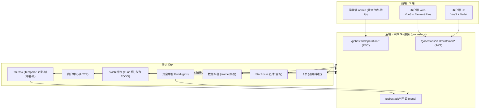

# BestAds 系统现状总索引

> 把「PRD 业务视图 × 后端实现 × 数据库 × 三端 UI」串成一张地图，作为方案讨论的导航入口。
> 生成：2026-06-09 ｜ 最近维护：2026-08-18 ｜ 维护者：产品（@欧伟权）+ AI
> 数据来源：`广告系统项目概述.md`（PRD 62 篇）、`后端-ai-context/`、`前端-客户端-frontend/`、`前端-h5-frontend/`、本地 `PRD/` 与 HTML 原型

---

## 0. 上下文文档地图（先看这里）

| 我想了解… | 看哪份 |
|---|---|
| 项目是什么 / 商业模式 / 业务全貌 | `广告系统项目概述.md` |
| PRD 原文（按版本 Vx.y） | `PRD/飞书同步/广告/广告媒体&代理/需求文档/` |
| 后端技术栈 / 模块 / API / 表 / 状态机 | `后端-ai-context/backend/`（`INDEX.md` 起） |
| 客户端 Web 路由 / 设计 token / 组件 | `前端-客户端-frontend/` |
| 客户端 H5 路由 / Varlet 主题 / 组件 | `前端-h5-frontend/` |
| 运营端 Admin 前端 | ⛔ **暂缺，独立仓库待补**（见 §6） |

**对应代码版本**：后端 `4419b0c7` ｜ 客户端 Web `f7e67e7e` ｜ H5 `25d0b8fe`

---

## 1. 系统拓扑

| 端 | 仓库 | 技术栈 | 鉴权 | 备注 |
|---|---|---|---|---|
| 运营端 Admin | **待补** | (待确认) | RBC `Authorization: Bearer`→`x-token` 校验 | 对应 PRD 大多数页面 |
| 客户端 Web | `bestads-front-end` | Vue3.3 / Vite4 / Element Plus / Pinia / ECharts | JWT 头 `accessToken` | 广告创编、资产、子账号、分析 |
| 客户端 H5 | （H5 仓库） | Vue3.5 / Vite6 / Varlet / UnoCSS / Less | 头 `accesstoken` + `source:H5` | 账户/钱包/记录/报告 + 登录 |
| 后端 | `go-bestads` | Go1.25 / Gin / GORM / Kafka / Temporal / rpcx | — | 端口 8484，治理 9903；MySQL+Redis+StarRocks |

---

## 2. 业务域 × 实现映射（核心地图）

> 「前端」列：W=客户端 Web，H=H5，A=运营端 Admin(待补)。表名见 §3。

| 业务域 | PRD | 后端 API 前缀 / 模块 | 关键表 | 前端 |
|---|---|---|---|---|
| 客户与公司/团队 | V1.0 | `operation/users`、`operation/companies`、`operation/merchant` | `tm_company`、`sys_user` | A |
| 子账号 + 角色权限 | V2.1 | `customer/users/subAccounts`、`customer/permissions` | `sys_user`、`sys_permission*` | W |
| 运营端权限控制(功能上限) | V2.X | `operation/sysPermission`、`operation/sysClientNotice` | `sys_permission*` | A |
| 开户（现网工单） | V1.0 / V2.X | `*/openAdsAccountTask/*` | `ads_account_task`(status -1~11) | W+A |
| 开户自动化（报价/扣费/账户规则） | V2.42 | 待研发；现网仍走 `*/openAdsAccountTask/*` | 待确认（申请级开户费/首充预缴、账户规则；无广告账户 ID 时不写空 `ads_account_recharge`） | W+A 原型已入库，后端未开始 |
| 广告账户 + 分配 | V1.0+ | `operation/adsAccount/*`、`customer/adsAccount/*` | `ads_accounts`、`ads_account_allocation_log` | W+A |
| 代理管理 | V1.5 | `operation/adsAgency/*` | `ads_agency`、`ads_agency_rate_history` | A |
| 钱包·在线充值·线下转账·明细 | V1.1 / V1.9 | `*/wallet/*`、`customer/fund/getFundToken` | `ads_customer_flow`、Fund 侧钱包 | W+H+A |
| 充值 / 减款 / 清零 | V1.1–V1.8 | `*/wallet/{adRecharge,adReduced,adClear,manualProcessing}` | `ads_account_recharge`(type=RECHARGE/REDUCED/CLEAR) | W+H+A |
| 服务费 | V1.5.1 / V2.18 | 充值单内拆分字段 | `ads_account_recharge`(`*_service_fee`) | A |
| 其他费用扣费 | V2.8 | `operation/customerFlow/createDebit` | `ads_customer_flow` | A |
| 返点(账户/类型/客户) | V2.3 / V2.11 | `operation/adsAccountRebate`、`adsAccountTypeRebate`、`adsCustomerRebate` | `ads_account_rebate`、`ads_account_type_rebate`、`ads_customer_rebate` | A |
| 介绍人 + 吐点结算 | V2.20 / V2.23 | `operation/adsIntroducerRebate/*`、`customer/.../queryRefereeDailyConsume` | `ads_introducer_*`(profile/relation/base+special rate/settlement_*) | W+A |
| 绩效 KPI | V2.11 | `operation/adsPerformance/*` | `ads_performance_*` | A |
| 报表（周/对账/洞察/生命周期/收支） | V2.4–V2.19 | `operation/adsWeekReport`、`adsRecoReport`、`adsInsightReport`、`customerLifecycle`、`customerFundChangeDaily` | `ads_media_account_report`、`customer_fund_change_daily`、`ads_customer_lifecycle_*` | A |
| IT双周会报表 | V2.42.1 | 待研发 | 复用钱包流水、`ads_account_recharge`、`ads_media_account_report`；窗口由统计日期 D 计算本期 `[D-14,D-1]`、上期 `[D-28,D-15]` | A 原型已入库，后端未开始 |
| Meta 多维看板 | V2.16 | `operation/adsInsightReport/metaBreakdowns` | (洞察事实表) | A |
| 期初 / 对账日报 | V2.4.1 | `operation/adsCustomerInitialSet/*` | `ads_customer_initial_set`、`ads_customer_statement_report` | A |
| 预充配置 | V2.11/2.14 | `operation/custPreRechargeConfig/*` | `ads_customer_pre_recharge_config` | A |
| 自动充值 + 余额监控 | V2.9 / V2.24 | `*/adsAutoTransaction/*` + Kafka `ads_recharge_event` | `ads_auto_transaction_rule(_account)`、`ads_auto_transaction_log` | W+A |
| 消耗下降提醒 | V2.13 | `operation/adsSpendDecline/*` | `ads_spend_decline_config/record` | A |
| 消耗补录 | V2.18 | `operation/adsSpendSupplement/*` + Temporal | `ads_media_account_report_supplement` | A |
| 绑卡户(Slash) | V2.21 | `operation/adsAccountCardBind/*` | `ads_account_card_bind`、`ads_slash_card`、`ads_card_apply`、`ads_card_view_audit` | A |
| Governor 违规/素材审核 | V1.3 负向治理 | `operation/adsGovernor/*` | `ads_ad_*`(governor 域) | A |
| 素材分析 | 素材系统 | `operation/materials/*` | `ma_*` | A |
| 广告创编(Meta/批量/ASC) | V1.3 / V1.10 | `customer/...`（service-admange） | — | W |
| 客户端通知 | V2.11.1 | `*/clientNotice/*`、`operation/sysClientNotice` | `sys_client_notice(_read)` | W+H+A |
| 导出中心 | 多处 | `operation/export/*` | `data_export_task` | A |

---

## 3. 数据库表速查（按域）

- **组织/账号/权限**：`tm_company`(公司·钱包币种·`fund_balance_id`)、`sys_user`(客户端用户/子账号)、`tm_ad_account`、`sys_permission*`、`sys_dict`/`sys_config`/`sys_operation_log`
- **广告账户/开户**：`ads_accounts`(`account_source` 1媒体/2一代/3导入)、`ads_account_allocation_log`、`ads_account_task`(开户工单 status -1~11)、`ads_media_user_token`、`ads_applovin_account_token`
- **资金**：`ads_account_recharge`(充值/减款/清零统一单·服务费拆分·`fund_tx_no`)、`ads_customer_flow`、`customer_fund_change_daily`、`ads_customer_initial_set`、`ads_customer_pre_recharge_config`、`ads_customer_statement_report`
- **消耗/报表**：`ads_media_account_report`(日消耗·`data_source` API/CRAWLER/MANUAL_*)、`ads_media_account_report_supplement`、`ads_customer_lifecycle_event`/`ads_customer_spend_daily`/`ads_customer_lifecycle_snapshot`
- **返点/吐点/绩效**：`ads_account_rebate(_history)`、`ads_account_type_rebate(_history)`、`ads_customer_rebate(_history)`、`ads_agency(_rate_history)`、`ads_introducer_profile`/`_customer_relation`/`_base_rate_segment`/`_special_rate_segment`/`_settlement_batch`/`_order`/`_detail`/`_approval`、`ads_performance_indicator/kpi/result(_summary)/log`
- **自动化/监控**：`ads_auto_transaction_rule(_account)`/`ads_auto_transaction_log`、`ads_spend_decline_config/record`
- **绑卡(Slash)**：`ads_account_card_bind`(`is_active_card`)、`ads_slash_card`、`ads_card_apply`、`ads_card_view_audit`
- **Governor/素材/杂项**：`ads_ad_info_change_record` 等 governor 域、`ma_*` 素材分析、`data_export_task`、`data_upload_*`、`sys_client_notice(_read)`、`ads_account_load_url_log`

> 字段/索引以 `internal/model/**` 的 gorm tag 为权威；`data/migrate_tables.go` 几乎全注释，不可当线上表全集。

---

## 4. 关键状态机 / 枚举速查

| 对象 | 字段 | 取值 |
|---|---|---|
| 充值/减款/清零单 `ads_account_recharge` | `type` | RECHARGE / REDUCED / CLEAR |
| 同上 | `status` | PROCESSING → COMPLETED / FAILED / MANUALLY(待人工) |
| 同上 | `record_from_client` | CUSTOMER / OPERATION / H5 / OPERATOR |
| 同上 | `data_source` | SYSTEM / UPLOAD |
| 开户工单 `ads_account_task` | `status`(int) | -1 待处理 / 0-8 蓝标·FB 审核链 / 9 取消 / 10 自动驳回 / 11 提交 |
| 吐点结算单 `ads_introducer_settlement_order` | `state` | DRAFT → BIZ_APPROVED → FINANCE_APPROVED → POSTED（/ *_REJECTED / CANCELLED） |
| 自动充值规则 `ads_auto_transaction_rule` | `rule_source` / `rule_condition_operator` / `status` | 1客户·2运营 / lessThan·equal·greaterThan / 1启用·2禁用 |
| Slash 卡 | `card_status` / 申请 `status` | NORMAL·FROZEN·CLOSED / PENDING_APPROVAL·SUCCESS·FAILED |

---

## 5. 三端设计风格速查

| 维度 | 客户端 Web (Element Plus) | H5 (Varlet) |
|---|---|---|
| 主色 | `#2759ff`（暗色 `#1f79ff`） | Varlet 主题色，4 套：md2/md3 × light/dark |
| 语义色 | 成功 `#00b42a` / 警告 `#ff7d00` / 危险 `#f53f3f` / 链接 `#3491fa` | Varlet `--hsl-success/warning/danger` |
| 字体 | Microsoft YaHei…，基号 **12px** | Roboto + SourceHanSans |
| 圆角 | 基 **8px**，输入框 2px | card **10px**，button 8px |
| 控件高度 | 32px（紧凑企业风） | 移动端 vmin（375 基） |
| 主题切换 | `html[data-theme=light/dark]`，存 `_cache_theme` | `StyleProvider`，存 `prefer-dark`/`varlet-theme-key` |
| 状态色组件 | `BestStatus` / `BestStatusDot` + dict 映射 | `var-chip` + dict 映射 |
| 列表范式 | `BestQueryForm`+`BestFormItem`+`BestTable`（分页 20，`[5,10,20,50,100]`） | 卡片 + `var-list` 无限滚动（页 10） |

---

## 6. 实现进度 / 缺口看板

| 状态 | 项 |
|---|---|
| ✅ 已实现（前后端+表+API 齐） | 客户/子账号/权限、开户工单、账户分配、充值/减款/清零、钱包/在线充值/线下转账、返点、绩效、期初/对账、各报表、自动充值、消耗下降、客户端通知、广告创编(Web)、H5 资产端 |
| 🔧 开发中（未上线） | **绑卡户(Slash)**：正在开发；后端 `card/syncLimits`、`card/freeze`、`cardApply/submit`、拉敏感信息等 Fund 调用仍为 TODO 桩 |
| 🔜 待评审（未上线） | **吐点 V2.23 三层模型**：现网仍是「基础+特殊」两层（V2.20）；V2.23 准备评审 |
| 📝 仅 PRD + 原型（研发未开始） | **V2.42 开户自动化**：本地 PRD `PRD/V 2.42 开户自动化.md`，运营端账户规则配置/开户管理与客户端申请开户/操作记录原型已入库（`ac20716`）；后端仍走现网开户工单，未按新报价/扣费闭环改造。 **V2.42.1 IT双周会报表**：本地 PRD `PRD/V 2.42.1 IT双周会报表 PRD.md`，运营端报表看板原型 `admin-system/reports/it-biweekly-data.html`；需按统计日期从现网钱包/充值/消耗汇总，研发未开始 |
| 📝 仅 PRD（未开始） | **广告自动规则引擎**（V2.X：开关/调预算/调出价）：只写了简单 PRD，尚未开始实现（自动充值 ≠ 广告自动规则） |
| 📦 不在后端仓库 | 定时任务、吐点**季度自动**结算、日报/对账统计 → 在 **tm-task**（Temporal）或外部调度 |
| ⛔ 文档缺口 | **运营端 Admin 前端**（独立仓库，待补） |

> 「开发中 / 待评审 / 仅 PRD」中绑卡户、吐点 V2.23、广告自动规则引擎已与产品确认 @2026-06-09。V2.42 开户自动化为 2026-08-17 本地 PRD+原型入库，研发未开始。V2.42.1 IT双周会报表为 2026-08-20 本地 PRD+原型入库，研发未开始。

---

## 7. 给协作 AI 的使用指引

- 讨论某需求先定位：本表 §2 找到业务域 → 对应 PRD 版本（看原文）+ 后端 API/表（看 `后端-ai-context`）+ 前端页面（看对应 frontend 文档）。
- 改后端：以 `internal/model|service|controller|routers` 为准，推断标 `(待确认)`。
- 改前端样式：客户端用 `var.scss`/theme 变量，H5 用 Varlet `StyleProvider`，勿硬编码颜色。
- 凡涉及资金流转：注意「广告系统只记账 + 调用资金中台 Fund」，真正的钱在 Fund 侧。
- 本索引随上下文文档更新而更新；各文档头部 commit 变化时同步本文件日期。
